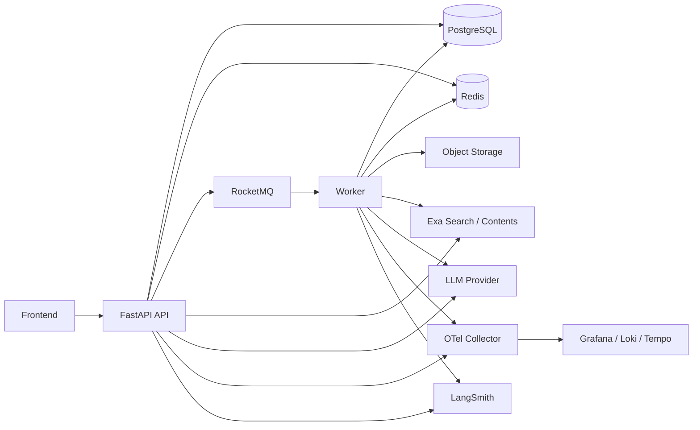
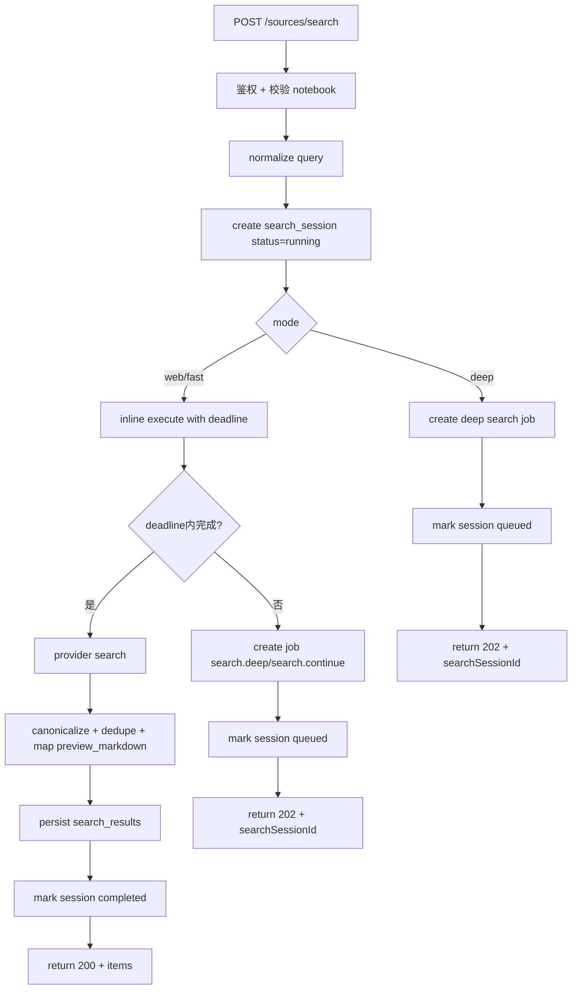
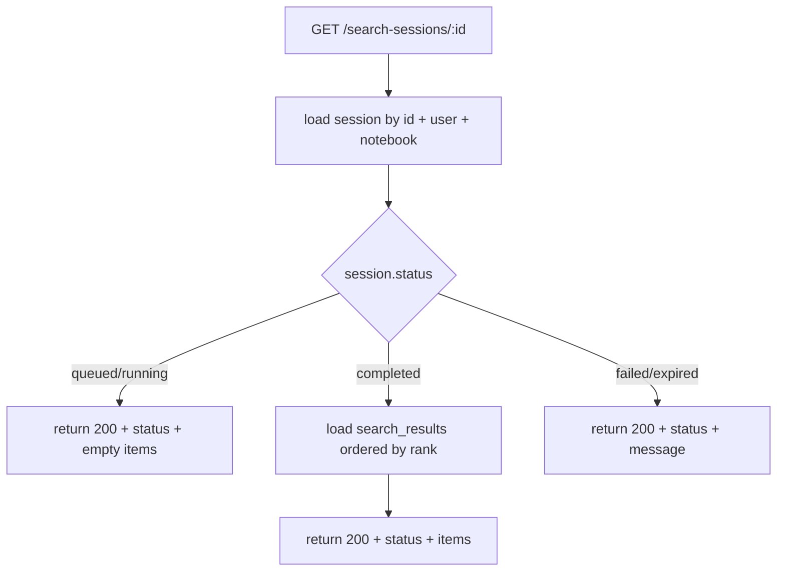
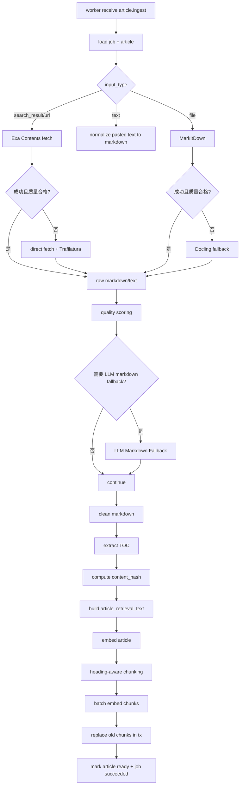
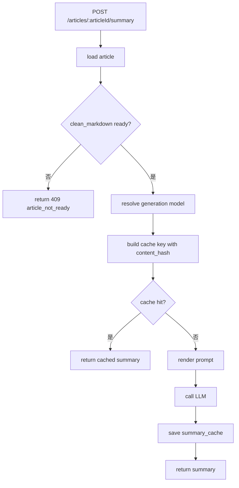
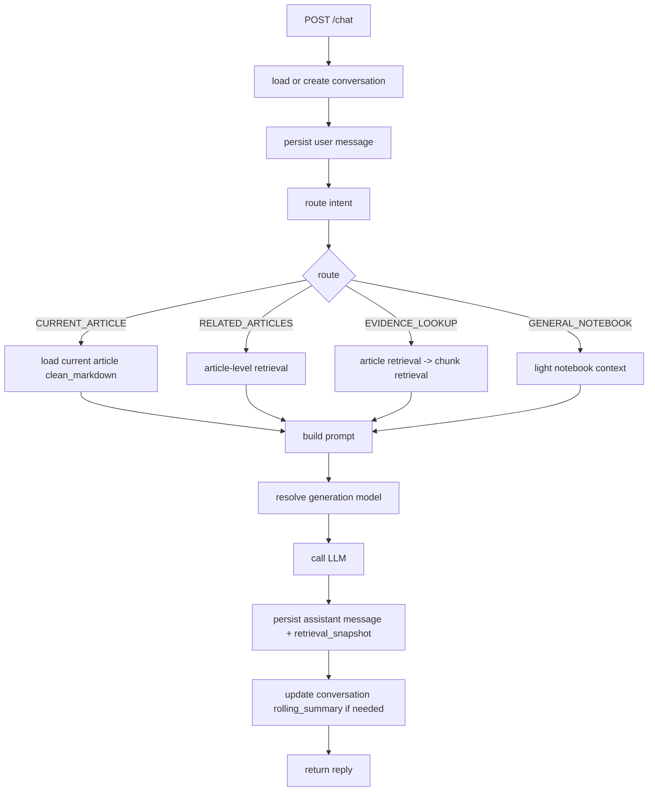

我把线索重新收束成一版**可直接落工程**的设计文档。下面这版不再来回切换“v1 / v2”，而是一次性把你现在真正要做的系统设计清楚：**search 是 AI 来源发现，不是 RAG；用户确认导入 notebook 后才开始 chunking；summary 和聊天里的“类似文章/相关资料”是实时计算，不做预计算推荐缓存；前端不需要感知导入链路的实时状态，但后端必须完整记录状态。** 当前契约里，`sources/search`、`sources/import`、`sources/upload`、`summary`、`chat` 的职责边界已经基本清楚，`chat` 也明确是前端只发最新一条消息、后端负责会话持久化和上下文组装；history 里也已经把“search 解决找什么，RAG 解决如何基于已拥有内容回答”和“chunking 从 import 开始”说清楚了。

这次我先给你完整的架构设计，再给关键函数流程图和执行计划。最重要的总原则有两条。第一，**搜索从第一天就做成“同一路由、按 mode 自动 sync/async 分流”**，而不是先硬做同步再返工，因为 Exa 官方已经把搜索能力分成低延迟的 `fast/instant`、默认高质量的 `auto` 和更重的 `deep/deep-reasoning`，Research API 更是明确的异步多步流水线。第二，**当前 UI 的搜索结果是可勾选的来源卡片，不是研究报告**，所以“Deep Research”在当前产品里不应该直接接 Exa Research API，而应该先用 Exa Search 的 `deep` 做更重的候选发现；Exa Research 以后适合独立做“生成研究报告”的能力。([Exa](https://exa.ai/docs/reference/search))

## 1. 业务领域识别与边界划分

### 1.1 用户与设置域

这一域只解决两件事：用户身份和生成模型设置。当前前端设置对象里有 `outputLanguage`、`themeColor`、`colorMode`、`modelProvider`、`modelName`、`apiUrl`、`apiKey`、`username`，但这里面其实混了三类数据：显示偏好、生成模型配置、用户资料。`username` 不是 settings，应该仍然属于 `users.name`；`apiKey` 也不应该和普通设置字段同一存储语义，因为它需要加密、脱敏和独立清空逻辑。

所以我建议这一域的职责收敛成一句话：**用户可以自带生成模型配置，也可以自带 Exa 搜索凭证，但系统内部的搜索 provider、嵌入模型、解析链路不跟着用户设置走。** 也就是说，BYOK 作用于 `summary/chat` 的生成模型，也作用于 `search` 使用的 Exa credential；这些用户级 key 都加密存数据库，由 settings/account 域统一管理和解密注入。`search` 的 provider 仍固定为 Exa，embedding 仍用平台固定模型。这样做的原因不是“偷懒”，而是避免把搜索 provider 选择、索引一致性、向量维度、重建索引成本都暴露给用户设置。当前前端设置里本来也没有 embedding 相关字段，这样切分最自然。

### 1.2 Notebook 工作空间域

这一域负责 notebook、note、article 这三个用户可见对象。`GET /api/notebooks/:notebookId` 当前就是前端中心接口，返回 `articles + notes`，后面搜索导入和文件上传成功后也都是刷新这个接口；所以 notebook 不是一个“容器抽象”，而是前端工作台的主实体。

这一域的关键设计点是：**用户看到的“来源文章”就是 article，不再额外引入一张 sources 领域表来增加跳转成本。** 搜索结果在 search 阶段只是候选卡片，真正导入后才变成 article。这样领域边界会非常清楚：`search_results` 属于“候选发现”，`articles` 属于“已进入 notebook 的内容”。

### 1.3 来源发现域

这一域只做一件事：**帮用户找到候选来源。** 当前契约里 `sources/search` 返回的是 `SourceSearchResult` 卡片：`id/title/description/icon/url/selected`；`sources/import` 则是把这些候选导入 notebook。这已经天然说明 search 不是 RAG，而是候选发现。

这里最重要的架构决策是：**把 search 设计成会话型领域对象。** 也就是每次搜索先生成 `search_session`，结果写 `search_results`；前端选择若干结果后，再通过 `searchSessionId + searchResultIds` 导入。这样 search 和 import 的关系是“候选集 -> 选择 -> 入库”，而不是“前端拿几条 URL 再回传”。这直接解决了你之前指出的 `sourceIds` 语义不完整问题，也让搜索质量复盘有了真实载体。

### 1.4 内容摄取与解析域

这一域从 import 之后才真正开始工作。history 已经把这一点说得很明确：**chunking 从用户确认导入 notebook 的那一刻开始。** search 阶段只找到候选结果，不做 chunking、不做 embedding、不做索引。

这一域的职责是把三类输入——搜索结果导入、手动 URL / text、文件上传——统一成一条 ingestion pipeline。你之前已经接受“确定性解析优先，AI 兜底”的原则；现在只需要把它真正工程化成一条可复盘的链：抓取原文、确定性解析、质量判定、LLM markdown fallback、clean markdown、TOC 提取、article 向量、chunking、chunk 向量、索引更新。

### 1.5 检索与对话域

这一域只对**已进入用户全部 notebooks 的内容**负责，不参与 search 阶段。history 里已经把这点写得很清楚：search 解决“找什么”，RAG 解决“如何基于已拥有内容回答”；而检索不应该每轮 chat 都触发，只在相关问题时才触发。

因此这一域内部要分两层。第一层是 article-level retrieval，负责“有没有类似文章”“其他 notebook 里有没有相关内容”；第二层是 chunk-level retrieval，只在用户明确要证据、出处、具体段落时才下沉。这样设计的好处不是“更学术”，而是能把大多数聊天成本压在 article 层，把 chunk 层留给真正需要精确证据的问题。

### 1.6 作业与可观测性域

这一域对用户不可见，但对系统稳定性至关重要。它负责异步任务、重试、补偿、链路追踪、指标和日志。你的前端不需要感知导入链路的实时状态变化，但这并不意味着后端不记状态；相反，后端必须完整记录 `search_session.status`、`article.parse_status`、`jobs.status`，只是这些状态先不做成用户交互的一部分。

## 2. 详细架构设计

### 2.1 运行时拓扑

我建议的运行拓扑不是复杂微服务，而是**单代码仓库、三个运行单元**：`api`、`worker`、`scheduler`。`api` 负责所有 HTTP；`worker` 负责 deep search 和 ingest 等长任务；`scheduler` 负责清理过期搜索会话、重发未发布任务、做缓存清理。外围依赖是 PostgreSQL、Redis、RocketMQ、对象存储、Exa、LangChain、LLM Provider、OTel Collector、LangSmith、Grafana/Loki/Tempo。这个形态足够轻，又不会把长任务塞进请求线程里。



这里最关键的不是图，而是两条约束。第一，**所有用户动作先写数据库，再发异步消息**。第二，**worker 不直接改前端视图模型，只改领域状态**，由 `GET /notebooks/:id` 统一组装成前端需要的数据。

### 2.2 Search 子系统：同一路由，自动 sync/async 分流

Exa 的 Search API 支持 `fast`、`auto`、`deep`、`deep-reasoning`、`instant` 等搜索类型；官方 best practices 把 `auto` 定位为最高质量默认档，把 `fast` 定位为低延迟档，把 `instant` 定位为实时应用最低延迟档，而 Research API 明确是异步多步流水线。基于这些能力边界，我建议对外 API 只暴露产品语义 `mode=web|fast|deep`，内部映射成 provider 类型：`web -> auto`，`fast -> fast`，`deep -> deep`。这样 UI 语义和 provider 语义都清楚。([Exa](https://exa.ai/docs/reference/search))

更重要的是执行策略。`web` 和 `fast` 不应该“永远同步”，而应该是**优先 inline，同步尝试执行，超过 deadline 自动降级成异步 session**。默认策略我建议是：`web/fast` 先在 API 进程内尝试 4.5 秒；如果 provider 在 deadline 内返回，就直接 `200 completed`；如果超时，就把 session 置为 `queued`，创建 `search.deep` 或 `search.continue` job，返回 `202 accepted`。`deep` 则一开始就直接异步。这样你只需要一套路由和一套前端处理模型，但不会让慢搜索拖垮 API 线程池。

### 2.3 为什么当前 Deep 模式不用 Exa Research API

Exa Research API 的能力很强，但它的输出目标是“把开放问题变成 grounded report / structured output”，而不是“返回一组可勾选来源卡片”；而你当前的 `sources/search` 响应模型仍然是 `SourceSearchResult` 卡片数组，用户下一步是选择若干结果导入 notebook，不是直接展示一份研究报告。([Exa](https://exa.ai/docs/reference/exa-research))

所以这次架构里，Deep 模式的正确实现是：**继续走 Exa Search，只是 provider type 用 `deep`，并在 worker 中允许更重的后处理**，例如更大的 `numResults`、更强的去重/重排、对 topN 结果补做 `/contents` enrich。Exa Research 可以在以后单独做成 `/research` 能力，它对应的是另一个业务对象 `research_session`，而不是当前的 `search_session`。

### 2.4 Search 结果预览：用 highlights，不用 summary 作为主预览

Exa 的 Search 和 Contents 都支持 `highlights`、`summary`、`text`。Contents 文档明确说明：`highlights` 是从源文抽取的相关片段，不是生成文本；`summary` 是 LLM 生成概述；`text` 返回 clean markdown，全页最完整。对于当前搜索侧栏和导入后即时可见内容，**主预览应该用 highlights，不该用 summary**。因为 highlights 更稳定、更省 token，而且是 extractive，不会把 provider 生成噪声直接暴露给用户。([Exa](https://exa.ai/docs/reference/contents-best-practices))

因此 search 阶段我建议这样做。API 调用 Exa `/search`，请求里直接带 `contents.highlights.maxCharacters`，让每条结果带回 query-relevant excerpts。服务端把它们拼成 `search_results.preview_markdown`。当用户 import 时，直接把这段 preview 拷贝到 `articles.preview_markdown`。这样就算全文还没解析好，notebook detail 里也已经有可显示的“预览正文”。

### 2.5 Ingestion 子系统：统一 pipeline，按输入类型分前置分支

Exa Contents 文档明确说明它能从 URL 提取 clean markdown，并处理 JS-rendered pages、PDF 和复杂布局；Trafilatura 支持把 HTML 抽正文并输出 markdown；MarkItDown 是 Python 的文件转 Markdown 工具；Docling 支持多种格式并可导出 Markdown。综合这些能力，我建议 ingest pipeline 的“前半段”按输入类型分支，“后半段”统一。([Exa](https://exa.ai/docs/reference/contents-best-practices))

具体来说，`search_result` 和 `url` 走 `Exa Contents -> Trafilatura fallback`。`text` 直接做 markdown 归一化。`file` 要分成两类：**`pdf` 保留原文件并优先直接展示，`doc/docx/txt/md` 转成 markdown 展示**。其中 `pdf` 仍然尽量在后台抽取 markdown / plain text，供 summary、chat、retrieval 使用，但 UI 默认不直接展示这份抽取文本，而是展示原 PDF。`doc/docx/txt/md` 则以 markdown 作为主展示形态。技术路径上，文件解析优先 `MarkItDown`，复杂文档或低质量结果再走 `Docling` / LLM fallback。一旦拿到候选正文，后面就统一走：质量评分、必要时 LLM markdown fallback、clean、TOC、content_hash、article_retrieval_text、article_vector、heading-aware chunking、chunk_vector、索引替换。

这里有一个我认为非常关键的细节：**preview_markdown、clean_markdown 和 file asset 是三个不同层级的内容对象。** `preview_markdown` 来自 search 阶段的 highlights，目的是在 article 还没 ready 时给 UI 一个可读占位。`clean_markdown` 才是解析完成后的标准正文，也是 summary/chat/retrieval 的真正输入。`pdf` 这类文件型来源还会额外保留一个原文件访问入口，例如 `file_url` 或受控文件流接口。前端不需要单独再打一个“获取目录”的接口；对 markdown 内容，目录可以前端从正文里提取；对 PDF，后端提取到的目录直接作为 `article.toc` 返回即可。也就是说，当前文章视图模型应该至少包含：`render_mode`、`content`、`file_url`、`toc`。

### 2.6 解析质量门控：什么时候触发 AI markdown fallback

“确定性解析优先，AI 兜底”如果不写成规则，最后就会变成所有失败都靠 LLM 硬顶。我建议把 fallback 触发条件写成硬规则，放进 `ParseQualityScorer`。

默认规则可以是：正文少于 500 字且原输入明显更长；heading 数为 0 且正文超过 3000 字；乱码字符比例超过 15%；连续空块超过阈值；标题缺失但原始输入有明显 title；Markdown 中链接密度异常高；表格或代码块丢失严重。只有命中这些规则，才调用 `LLMMarkdownFallback`. 这样你后面不仅知道成本花在哪，还能对 fallback 命中率做指标和优化。

### 2.7 Retrieval 子系统：article 先行，chunk 按需下沉

PostgreSQL 原生支持全文检索，GIN 是推荐的 text search index；pgvector 提供向量搜索，HNSW 在速度/召回折中上优于 IVFFlat，但建索引更慢、占内存更多。基于这一点，我建议 article 和 chunk 的检索都先放 PostgreSQL，同库完成。([PostgreSQL](https://www.postgresql.org/docs/current/textsearch-indexes.html?utm_source=chatgpt.com))

article-level retrieval 的输入是 `article_retrieval_text` 和 `article_vector`。`article_retrieval_text` 不是 article summary，而是一段确定性拼接文本，我建议构造为：`title + 前 8 个 heading + clean_markdown 头部摘要段`。检索时用 `ts_rank_cd(article_tsv, query_ts)` 做 lexical rank，用 `1 - cosine_distance(article_vector, query_vector)` 做 semantic score，再用简单 RRF 融合。这个层次服务于聊天里的“类似文章”“相关资料”，也服务于跨 notebook 粗召回。

chunk-level retrieval 只在路由命中“证据型问题”时触发。chunk 大小建议 500 到 700 token，overlap 80，按 heading 切块，保留 `section_path` 和 `heading_title`。这个层次不应该抢在 article 层前面，因为它成本更高，结果也更碎。

### 2.8 Generation 子系统：LangChain 统一编排，BYOK 只影响生成与搜索凭证，不影响索引

当前设置页里有 `modelProvider`、`modelName`、`apiUrl`、`apiKey`，说明用户生成模型是可配置的。我建议 AI 执行层统一用 **LangChain / LCEL**。也就是说，`summary`、`chat`、`LLM markdown fallback` 都通过 LangChain runnable 或 chain 来编排；模型解析不再直接返回裸 SDK client，而是返回 LangChain `BaseChatModel` / `Embeddings` 适配实例。它的规则有两条：用户设置了 BYOK，就从数据库解密后构造对应 LangChain model；`search` 侧如果需要 Exa key，也从数据库解密当前用户的搜索凭证再注入 provider adapter。当前阶段不设平台默认生成模型。

embedding 则必须平台托管，不能跟着用户设置走。原因很直接：如果 embedding 也跟用户模型走，那你会遇到向量维度不一致、历史内容无法比较、需要按用户重建索引、检索质量不可控等一系列问题。把 generation / search credential 和 embedding 分开，是这个系统长期可维护的关键之一。

### 2.9 Summary 设计：用户触发、版本化缓存、严格依赖 clean_markdown

当前契约里 `/summary` 是用户点击文章上的“AI 摘要”；history 里也接受了“summary 是点击才生成，不预计算”的边界。因此这里不应该再引入 `article_summary` 作为持久化领域对象。正确设计是：`summary` 是一个**可缓存的计算结果**，不是 article 自带属性。

缓存键我建议直接定成：

```text
article_id + content_hash + prompt_version + model_provider + model_name + output_language
```

这里 `content_hash` 必须在内。否则 article 一旦重新解析，缓存就会脏。summary 接口也必须严格依赖 `clean_markdown`，而不是 `preview_markdown`。如果全文还没 ready，直接返回 `409 article_not_ready`。

### 2.10 Chat 设计：先路由，再检索，再组 prompt

当前契约里 chat 的职责归属是对的：前端只发最新一条 message，后端负责会话持久化、窗口裁剪、摘要压缩、检索和 system prompt 组装。这个架构不用推翻，只要把路由做实。

我建议 chat 路由器先分成四类意图。`CURRENT_ARTICLE` 用当前 article 直接回答；`RELATED_ARTICLES` 触发 article-level retrieval；`EVIDENCE_LOOKUP` 触发 article + chunk 两级检索；`GENERAL_NOTEBOOK` 只在 notebook 级上下文里做轻量回答。第一轮实现时，`CURRENT_ARTICLE` 和 `RELATED_ARTICLES` 就够用了；`EVIDENCE_LOOKUP` 可以先打通接口和内部枚举，但不一定一开始就做得很重。

会话窗口建议保留最近 8 到 12 条消息，再加一段 `rolling_summary`。`messages` 里要存 `retrieval_snapshot_json`，里面记录这轮回复使用了哪些 article 或 chunk、得分是多少。这个字段以后排错非常值钱。

### 2.11 RocketMQ 与 jobs：MQ 负责运输，jobs 负责真相

RocketMQ Dashboard 官方文档明确说明它能看 broker、topic、consumer、消息记录、死信、消息轨迹等；Prometheus Exporter 则把 broker/client 的指标经 `/metrics` 暴露给 Prometheus。也就是说，RocketMQ 这块从 day 1 就应该作为**可观测的异步骨架**接入，而不是只当一个黑盒队列。([RocketMQ](https://rocketmq.apache.org/zh/docs/deploymentOperations/04Dashboard/))

但 RocketMQ 不是业务状态真相。真正的真相还得落在 `jobs` 表里。所以我的建议是：所有长任务都先写 `jobs` 行，再发 RocketMQ；worker 消费后推进 `jobs.status`。topic 先收敛成一个，例如 `notebook_async`，tag 先用 `search.deep`、`article.ingest`、`article.reindex`、`maintenance.cleanup`。这个粒度足够清楚，也不至于一开始 topic 爆炸。

### 2.12 可观测性：OTel 打全链路，LangSmith 看 LangChain / LLM

OpenTelemetry Python 官方提供了 FastAPI 和 SQLAlchemy 的 instrumentation；而 LangSmith 则天然适合承接 LangChain 的 chain、retrieval、model call 和 prompt trace。换句话说，你完全可以把系统监控分两层：OTel 负责全链路基础遥测，LangSmith 负责 LangChain / LLM 专项 trace。([OpenTelemetry Python Contrib](https://opentelemetry-python-contrib.readthedocs.io/en/latest/instrumentation/fastapi/fastapi.html))

最少要打通的 trace 字段是：`trace_id`、`user_id`、`notebook_id`、`article_id`、`search_session_id`、`conversation_id`、`job_id`、`provider`、`model_name`。search、import、ingest、summary、chat 五条链都要贯通这些字段。

## 3. 代码结构设计

我这次建议你**不要再用纯 layer-first 目录**，而是改成**domain-first + shared infra**。原因很简单：你自己已经要求从业务领域到 API、数据库、实现链路都要连贯，那代码结构也应该跟着业务域走，而不是先分成一堆全局 `services/repos/models` 再到处跳文件。

```text
app/
  main.py

  api/
    deps.py
    errors.py
    middleware.py
    response.py

  modules/
    auth/
      router.py
      schemas.py
      service.py
      repo.py

    settings/
      router.py
      schemas.py
      service.py
      repo.py
      crypto.py

    notebooks/
      router.py
      schemas.py
      service.py
      repo.py
      assembler.py

    notes/
      router.py
      schemas.py
      service.py
      repo.py

    sources/
      router.py
      schemas.py
      service_search.py
      service_import.py
      service_manual.py
      repo_search.py
      repo_article.py
      canonicalizer.py
      preview_builder.py
      dto.py

    ingest/
      worker_handler.py
      service.py
      parser_router.py
      quality_scorer.py
      markdown_cleaner.py
      toc_extractor.py
      retrieval_text_builder.py
      chunker.py
      embedder.py
      indexer.py
      parsers/
        exa_contents_parser.py
        trafilatura_parser.py
        markitdown_parser.py
        docling_parser.py
        llm_markdown_fallback.py

    retrieval/
      article_retriever.py
      chunk_retriever.py
      fusion.py
      router.py

    ai/
      summary_service.py
      chat_service.py
      conversation_service.py
      langchain_factory.py
      chains/
        summary_chain.py
        chat_chain.py
        markdown_fallback_chain.py
      prompts/
        summary_prompt.py
        chat_prompt.py
        markdown_fallback_prompt.py

    jobs/
      repo.py
      publisher.py
      idempotency.py

  infra/
    db/
      base.py
      session.py
      models.py
      migrations/
    mq/
      rocketmq_client.py
      topics.py
      consumer.py
      producer.py
    cache/
      redis_client.py
    storage/
      object_store.py
    providers/
      exa/
        search_client.py
        contents_client.py
        mapper.py
    ai/
      langchain_factory.py
    telemetry/
      logging.py
      tracing.py
      metrics.py
      langsmith.py

  workers/
    run_worker.py
    handlers/
      handle_search_deep.py
      handle_article_ingest.py
      handle_article_reindex.py
      handle_cleanup.py

  tests/
    unit/
    integration/
    e2e/
```

这个结构有四条依赖规则必须守住。第一，router 只调 service，不直接调 repo 或 provider。第二，repo 只做数据库读写，不调用 provider。第三，worker 不重复业务逻辑，而是复用 `modules/*/service.py`。第四，provider adapter 返回统一 DTO，不把 Exa 原始响应结构扩散到整个系统。

### 3.1 关键文件与主函数

下面这些函数是你最先要定义稳的接口层和服务层骨架：

| 文件                                | 主函数                                                         | 作用                                                        |
| ----------------------------------- | -------------------------------------------------------------- | ----------------------------------------------------------- |
| `modules/sources/service_search.py` | `start_search(user_id, notebook_id, req)`                      | 创建 search session，决定 inline 还是 enqueue               |
| `modules/sources/service_search.py` | `execute_search(session_id)`                                   | 调 provider，去重、归一化、持久化结果                       |
| `modules/sources/service_import.py` | `import_results(user_id, notebook_id, session_id, result_ids)` | 从 search results 生成 article 占位并建 job                 |
| `modules/ingest/worker_handler.py`  | `process_article_ingest(job_id)`                               | 整条 ingest pipeline 的 worker 入口                         |
| `modules/ingest/parser_router.py`   | `parse_article(article)`                                       | 按 input_type 选择 Exa / Trafilatura / MarkItDown / Docling |
| `modules/ai/langchain_factory.py`   | `build_chat_model(user_id)` / `build_summary_chain(...)`       | 从数据库解密用户配置并构造 LangChain model / chain          |
| `modules/ai/summary_service.py`     | `get_summary(user_id, notebook_id, article_id, req)`           | 版本化缓存 + LangChain 摘要链                              |
| `modules/ai/chat_service.py`        | `reply(user_id, notebook_id, req)`                             | 会话持久化、路由、检索、prompt、LangChain 对话链            |
| `modules/retrieval/router.py`       | `route(message, article_id)`                                   | 判断 current_article / related_articles / evidence          |
| `modules/notebooks/assembler.py`    | `build_notebook_detail(notebook_id)`                           | 把 article/note 组装成前端所需视图                          |
| `modules/settings/service.py`       | `get_settings(user_id)` / `update_settings(user_id, patch)`    | merge 默认值、脱敏 key、局部更新                            |

### 3.2 关键函数签名

```python
def start_search(
    user_id: UUID,
    notebook_id: UUID,
    query: str,
    mode: Literal["web", "fast", "deep"],
    max_results: int = 10,
    freshness_hours: int | None = None,
) -> SearchStartResult: ...

def execute_search(session_id: UUID) -> SearchCompletedResult: ...

def import_results(
    user_id: UUID,
    notebook_id: UUID,
    search_session_id: UUID,
    search_result_ids: list[UUID],
) -> NotebookDetailDTO: ...

def process_article_ingest(job_id: UUID) -> None: ...

def get_summary(
    user_id: UUID,
    notebook_id: UUID,
    article_id: UUID,
    output_language: str | None,
    force_refresh: bool = False,
) -> SummaryDTO: ...

def reply(
    user_id: UUID,
    notebook_id: UUID,
    conversation_id: UUID | None,
    article_id: UUID | None,
    message: str,
) -> ChatReplyDTO: ...
```

## 4. 关键函数流程图

### 4.1 `POST /api/notebooks/:id/sources/search`

当前搜索栏已经是 `Web / Fast Research / Deep Research` 三种模式，而 Exa 本身也明确有低延迟与深度搜索分层，所以这一条链路最核心的是**创建 search session 后再执行，不要直接把 provider 调用当成一次性函数返回值**。([Exa](https://exa.ai/docs/reference/search))



### 4.2 `GET /api/notebooks/:id/search-sessions/:searchSessionId`

这个接口是 deep mode 和 timeout fallback 的统一读取口。它不需要复杂逻辑，只负责把 session 状态和结果投影给前端。



### 4.3 `POST /api/notebooks/:id/sources/import`

history 已经明确了这条边界：**import 的意义是“用户确认把候选结果导入 notebook”，chunking 从这里开始。**

```mermaid
flowchart TD
  A[POST /sources/import] --> B[校验 searchSessionId / resultIds 归属]
  B --> C[加载 search_results]
  C --> D[按 canonical_url / hash 做 notebook 内去重]
  D --> E[事务开始]
  E --> F[创建 article 占位记录]
  F --> G[拷贝 preview_markdown 到 article.preview_markdown]
  G --> H[创建 jobs(article.ingest)]
  H --> I[事务提交]
  I --> J[publish RocketMQ message]
  J --> K[build_notebook_detail]
  K --> L[return NotebookDetail]
```

### 4.4 `process_article_ingest(job_id)`

这条 worker 链是整个系统最值钱的地方。你以后所有“为什么这篇文章没有正文、为什么摘要不对、为什么检不到”的排查都围绕它。



### 4.5 `POST /summary`



### 4.6 `POST /chat`



## 5. 详细执行计划

### 5.2 步骤 1：搭底座，但直接按最终运行形态搭

这一阶段不是“先起个 FastAPI 项目”。你要一次把这些都起起来：FastAPI、SQLAlchemy 2.0、Alembic、PostgreSQL、Redis、RocketMQ、对象存储接口、LangChain、OTel、LangSmith、结构化日志。history 里已经把底座建议成 `FastAPI + Pydantic + SQLAlchemy + PostgreSQL + Redis + worker + OTel` 这一套，这个方向没问题；我这里只是把 RocketMQ、LangChain 和 Exa provider 层也直接纳进来了。

这一步要同时产出 `infra/db/session.py`、`infra/mq/*`、`infra/providers/exa/*`、`infra/ai/langchain_factory.py`、`infra/telemetry/*`、`infra/storage/object_store.py`，以及所有**系统级** env 配置项。至少包括：`EMBEDDING_PROVIDER`、`EMBEDDING_MODEL`、`ROCKETMQ_NAMESRV_ADDR`、`SEARCH_INLINE_DEADLINE_MS`、`SUMMARY_CACHE_TTL_DAYS`、`LANGSMITH_API_KEY`、`LANGSMITH_PROJECT`、`LANGSMITH_TRACING`。这里要明确一条边界：用户级 `llm/exa api key` 不放 env，不放配置模块，而是加密存数据库。

### 5.3 步骤 2：先把 P0 全部落完，但把 settings 做对

P0 仍然是 auth、notebooks、notes、settings、account，这个顺序不需要再争论。当前契约已经把这一层列得很清楚，而且 notebook detail 是中心接口，应该尽快让前端从 mock 切掉。

但这次要特别注意 `settings`。数据库不建 `user_settings` 表，而是 `users.settings_json + llm_api_key_ciphertext + llm_api_key_last4 + exa_api_key_ciphertext + exa_api_key_last4`。`GET /settings` 由 service 层聚合生成默认值并做脱敏；`PUT /settings` 按 patch 合并。与此同时，`PATCH /account/profile` 只改 `users.name`，绝不把 `username` 落进 settings JSON。这个细节如果一开始做错，后面设置、资料和凭证会永远缠在一起。

### 5.4 步骤 3：先做 Exa Adapter，再做 Search Session

这一步的顺序必须是：**先 provider adapter，后 search service，最后 router**。因为 search 是整个来源链的起点，它不是简单 HTTP 转发。Exa Search API 已经支持在搜索结果里直接抽取 highlights / summary / text，所以 adapter 层要先把 Exa 原始结构映射成内部 DTO，避免业务层到处读 provider 字段。([Exa](https://exa.ai/docs/reference/search))

这一阶段你要写四个核心组件。`ExaSearchClient.search()` 只负责请求 Exa `/search`，并接受当前用户解密后的 Exa key。`ExaResultMapper.map_results()` 负责把 provider 响应转成统一 `SearchCandidateDTO`。`SourceSearchService.start_search()` 负责 session 创建和 sync/async 分流。`SourceSearchService.execute_search()` 负责真正执行、去重、持久化 `search_results`。完成标准是：`web/fast` 能在 deadline 内同步返回结果；`deep` 或 inline 超时能返回 `202 + searchSessionId`；`GET /search-sessions/:id` 能正确读出状态与结果。

### 5.5 步骤 4：实现 import，但先把去重和 preview 用好

这一阶段最容易犯的错是：一想到 import 就去抓网页、做 chunk。其实 import 的第一责任是**把候选结果稳稳地变成 article 占位记录**。真正的正文抓取和解析都属于 worker。

所以 `SourceImportService.import_results()` 要先把三件事做好。第一，按照 `searchSessionId + searchResultIds` 校验归属。第二，按 notebook 内 dedupe_key 去重。第三，把 `search_results.preview_markdown` 拷进 article。这样 import 一返回，前端就已经能在 notebook detail 里看到导入的文章和预览内容，而不是一堆空壳。这个设计直接消解了“前端不想感知导入状态变化”和“导入后又看不到东西”之间的矛盾。

### 5.6 步骤 5：建统一 ingest pipeline，把 search/url/text/file 都收口，并明确 markdown/pdf 双渲染模式

这一步的重点不是“多支持几种格式”，而是**用同一条 pipeline 统一所有输入，同时把 UI 渲染模式定清楚**。history 里已经把统一链路写成 `raw input -> deterministic parse -> AI markdown fallback -> clean markdown -> article embedding -> heading-aware chunking -> chunk embedding -> index`，我建议保留这个骨架，但加上一条前端约束：**article 必须支持 `render_mode=markdown|pdf`**。对于 `pdf`，原文件需要被保留并可直出；对于 `doc/docx/txt/md`，最终主展示内容是 markdown。summary/chat/retrieval 一律尽量依赖 `clean_markdown`，即使 UI 当前展示的是 PDF。

这一阶段至少要产出以下组件：`ParserRouter`、`ParseQualityScorer`、`MarkdownCleaner`、`TOCExtractor`、`RetrievalTextBuilder`、`HeadingAwareChunker`、`Embedder`、`IndexUpdater`，以及一个文件访问策略（`file_url` 或文件流接口）。验收标准不是“代码跑通”，而是：URL、text、file 三类输入都能最终产出 `render_mode / clean_markdown / toc_json / content_hash / article_retrieval_text / article_vector / chunks`；其中 `pdf` 还要具备可直接展示的原文件访问入口。

### 5.7 步骤 6：把 `/sources` 和 `/sources/upload` 接到同一条链，不再分叉

手动 URL 和粘贴文本这条 `POST /sources` 当前契约里已经有；上传这条 `POST /sources/upload` 也已经有，只是文档还保留了图片和音频描述，你这次要顺手删掉。`/sources` 是创建即确认，所以可以直接建 article + job；`/upload` 也是创建即确认，只是输入是文件。两者的后半段不应该再有分叉。

这一阶段的关键不是新功能多少，而是**验证统一 pipeline 没有绕路逻辑**。如果你发现 `search/import`、`sources(web/text)`、`upload(file)` 在 worker 里走了三套不同函数，那就是架构走偏了。

### 5.8 步骤 7：实现 article-level retrieval，并把它接进 chat router

这一阶段先不做 chunk 检索。先把 article-level retrieval 做扎实：`article_tsv + article_vector + user_id` 过滤 + `rrf` 融合。把这条能力先接给 chat router 的 `RELATED_ARTICLES` 分支。完成标准很简单：当用户问“我以前看过类似的吗”“还有没有相关资料”，系统能从该用户全部 notebooks 里召回一批相关 article，并把它们作为上下文或回复附带对象返回。

这一步不会直接带来一个独立新页面，但它会决定你后面 summary/chat 的质量天花板。

### 5.9 步骤 8：实现 summary，缓存一次做好

`summary` 的服务本身不复杂，复杂的是缓存键和模型解析。你这一步要写 `LangChainFactory`、`SummaryCacheRepo`、`SummaryService` 三块。关键点是：cache key 带 `content_hash`；如果 article 还没 ready，就返回 `409 article_not_ready`；如果用户没配 BYOK，就返回 `422 model_config_required`。

验收标准是：同一篇未变更文章重复点击摘要时命中缓存；文章重新解析后自动 miss 老缓存。

### 5.10 步骤 9：实现 chat，先把持久化和路由做好，再加 citation

这一阶段不要上来就追求“会回答所有问题”。真正该先做的是：会话可持久化、最近窗口能裁剪、当前文章问题能直接答、相关问题能走 article retrieval。当前契约里其实已经给了正确边界，后端负责会话持久化和上下文构造；你要做的是把这个边界落到 `conversations/messages` 上。

这一阶段至少要写 `ConversationService`、`ChatRouter`、`ChatService`、`PromptBuilder`。`messages.retrieval_snapshot_json` 也要一并写上，不然后面你没法复盘模型到底看了哪些文档。citation 和 chunk-level retrieval 可以在这一阶段把数据结构先打通，但不一定要一开始做成最复杂。

### 5.11 步骤 10：补齐观测与后台维护任务

这一阶段你至少要打通三类面板：search、ingest、LLM。search 面板看 inline 成功率、降级到 async 的比例、provider 耗时、search result 导入率；ingest 面板看 parse 成功率、fallback 命中率、平均 chunk 数、失败类型；LLM 面板看 summary/chat 延迟、token、成本、错误率。LangSmith 负责承接 LangChain 的 chain、retrieval、model call 和会话 trace；FastAPI 和 SQLAlchemy 侧用 OTel 自动埋点即可。

同时加一个 `scheduler` 做四件事：过期 `search_sessions`，清理旧 `summary_cache`，重发 `jobs.status=pending_publish` 的任务，归档或清理长期失败的 jobs。这样系统会很稳，不会逐步积垃圾。

### 5.12 步骤 11：最后做压测与回归基线，不要边写边猜

history 里已经明确了最关键的压测场景：登录到 notebook detail、note CRUD、`sources/search`、`sources/import`、`sources/upload`、`summary/chat`；真正要看的不是单纯 QPS，而是 provider 耗时、解析耗时、embedding 耗时、chunk 分布、retrieval 耗时和 LLM 首 token / 全量耗时。

这一步的目标不是“追求大并发”，而是建立你的第一套**回归基线**。只要这套基线在，你后面改 chunk 大小、改 retrieval 融合、改 Exa 参数，才能知道是变好了还是变差了。

## 6. 这版设计里最关键的 8 个决定

第一，`search` 从第一天就是会话型对象，不是一次性 HTTP 调用结果。
第二，`web/fast` 先 inline，超时自动降级异步；`deep` 直接异步。
第三，当前 Deep 模式不直接用 Exa Research，而用 Exa Search `type=deep`；Research API 以后单独做研究报告。
第四，search 预览用 `highlights`，不用 `summary` 作为主预览。([Exa](https://exa.ai/docs/reference/contents-best-practices))
第五，导入后 article 先有 `preview_markdown`，再异步补 `clean_markdown`，从而前端不需要处理导入状态。
第六，`search` 的 provider 固定为 Exa，但 credential 与生成模型凭证都走用户配置并加密存库；embedding 仍平台托管。
第七，检索表示用 `article_retrieval_text`，不引入 `article_summary`。
第八，RocketMQ 负责消息传输，`jobs` 表负责业务状态和补偿。([RocketMQ](https://rocketmq.apache.org/zh/docs/deploymentOperations/04Dashboard/))

下一条我可以直接继续把这份设计往下推成**“精确到表字段、接口请求响应、类图和伪代码”的实现稿**。
