# NotebookLM 项目架构与关键流程梳理

- 后端 API：`backend/app/main.py` 与各模块 router/service
- 异步执行：`backend/app/workers`
- 基础设施：`docker-compose.yml`、`docker/*`
- 观测：Prometheus / Loki / Tempo / Grafana

## 1. 组件总览

| 层         | 组件                                | 关键文件                                                                                                                            | 主要职责                                                            | 依赖                                                     |
| ---------- | ----------------------------------- | ----------------------------------------------------------------------------------------------------------------------------------- | ------------------------------------------------------------------- | -------------------------------------------------------- |
| 客户端     | React SPA                           | `frontend/src/App.jsx`, `frontend/src/pages/HomePage.jsx`, `frontend/src/pages/NotebookPage.jsx`, `frontend/src/services/appApi.js` | 登录、笔记本列表、文章阅读、来源搜索、导入、AI Chat、Summary、Notes | FastAPI API                                              |
| API 层     | FastAPI                             | `backend/app/main.py`                                                                                                               | 路由注册、依赖注入、中间件、生命周期、统一观测初始化                | Postgres、Redis、Kafka、对象存储、LLM/Search provider |
| 认证       | Auth 模块                           | `backend/app/modules/auth/*`                                                                                                        | 注册、登录、token 校验、用户读取                                    | Postgres                                                 |
| 业务聚合   | Notebook / Notes                    | `backend/app/modules/notebooks/*`, `backend/app/modules/notes/*`                                                                    | 笔记本与笔记 CRUD、Notebook detail 聚合                             | Postgres                                                 |
| 搜索       | Search 模块                         | `backend/app/modules/search/*`                                                                                                      | Exa 搜索、搜索会话、搜索结果、来源导入、手动来源创建、文件上传      | Exa、Postgres、对象存储、Kafka                           |
| 导入与索引 | Ingest 模块                         | `backend/app/modules/ingest/*`                                                                                                      | 正文解析、清洗、质量评分、chunking、embedding、向量/全文索引        | Exa Contents、Trafilatura、LLM、pgvector、对象存储       |
| 对话与摘要 | AI 模块                             | `backend/app/modules/ai/*`, `backend/app/modules/retrieval/*`                                                                       | Chat Router、RAG 检索、Conversation、Summary Cache、SSE 流式输出    | LLM Provider、Postgres、pgvector                         |
| 异步任务   | Jobs 模块                           | `backend/app/modules/jobs/*`                                                                                                        | Job 建模、发布、重发、inline fallback                               | Kafka、Worker、Scheduler                                 |
| Worker     | 异步消费者                          | `backend/app/workers/run_worker.py`                                                                                                 | 消费 `search_deep`、`article_ingest`、`article_reindex`             | Kafka、Postgres、Exa、LLM、对象存储                      |
| Scheduler  | 定时任务                            | `backend/app/workers/run_scheduler.py`, `backend/app/modules/jobs/scheduler.py`                                                     | 重发 pending job、清理失败 job、清理过期会话/摘要缓存               | Postgres、Kafka                                          |
| 存储       | Postgres + pgvector                 | `docker-compose.yml`, `backend/app/modules/notebooks/models.py`                                                                     | 主业务数据、全文检索、向量检索                                      | API、Worker、Scheduler                                   |
| 文件存储   | MinIO / 本地文件                    | `backend/app/modules/search/file_storage.py`, `backend/app/infra/storage/object_store.py`                                           | 上传文件落盘/对象存储、文件回放与下载                               | API、Worker                                              |
| 队列       | Kafka + kafka-exporter              | `backend/app/infra/mq/*`, `docker-compose.yml`, `docker/prometheus/prometheus.yml`                                                  | Job 传递、消费者位点管理、lag/offset 指标暴露                       | API、Worker、Scheduler                                   |
| 搜索提供方 | Exa                                 | `backend/app/infra/providers/exa/*`                                                                                                 | 搜索结果与网页正文抓取                                              | API、Worker                                              |
| 模型提供方 | Ollama / OpenAI-compatible          | `backend/app/modules/ai/prompts/*`, `backend/app/infra/ai/chat_models.py`, `backend/app/infra/ai/embedder.py`                       | Chat、Summary、Embedding                                            | API、Worker                                              |
| 观测       | Prometheus / Loki / Tempo / Grafana | `docker/prometheus/prometheus.yml`, `docker/promtail/config.yaml`, `backend/app/infra/telemetry/*`                                  | 指标、日志、Trace 聚合与展示                                        | API、Worker、Scheduler                                   |

## 2. 总体架构图

### 2.1 ASCII 架构图

```text
┌─────────────────────────────────────────────────────────────────────────────┐
│                                User / Browser                              │
└──────────────┬──────────────────────────────────────────────────────────────┘
               │ HTTP / SSE
               v
┌─────────────────────────────────────────────────────────────────────────────┐
│                         React SPA (Vite, frontend)                         │
│  - HomePage                                                                │
│  - NotebookPage                                                            │
│  - SourcePanel / SettingsModal / NoteModal                                 │
│  - appApi.js                                                               │
└──────────────┬──────────────────────────────────────────────────────────────┘
               │ /api/*
               v
┌─────────────────────────────────────────────────────────────────────────────┐
│                            FastAPI Backend API                              │
│  routers: auth / notebooks / notes / search / ai / settings / health       │
│                                                                             │
│  sync service calls:                                                        │
│  - Auth / Notebook / Notes CRUD                                             │
│  - Search session creation + Exa inline search                              │
│  - Text / File immediate ingest                                              │
│  - Chat / Summary SSE                                                        │
│  - Settings update + optional reindex scheduling                             │
└───────┬─────────────────┬──────────────────┬──────────────────┬────────────┘
        │                 │                  │                  │
        │ SQL             │ Files            │ Search / Content │ LLM / Embed
        v                 v                  v                  v
┌──────────────┐   ┌──────────────┐   ┌──────────────┐   ┌──────────────────┐
│ Postgres +   │   │ MinIO /      │   │ Exa          │   │ Ollama /         │
│ pgvector     │   │ local files  │   │ Search/      │   │ OpenAI-compatible│
│              │   │              │   │ Contents     │   │ Chat/Embedding   │
└──────┬───────┘   └──────────────┘   └──────────────┘   └──────────────────┘
       │
       │ create jobs / mark queued
       v
┌─────────────────────────────────────────────────────────────────────────────┐
│                             Kafka + kafka-exporter                           │
└──────────────┬──────────────────────────────────────────────────────────────┘
               │ consume
               v
┌─────────────────────────────────────────────────────────────────────────────┐
│                                   Worker                                    │
│  jobs:                                                                      │
│  - search_deep                                                              │
│  - article_ingest                                                           │
│  - article_reindex                                                          │
│                                                                             │
│  worker side effects:                                                       │
│  - fetch Exa Contents / Trafilatura / file parser                           │
│  - clean + score + optional LLM fallback                                    │
│  - chunk + embedding + replace article_chunks                               │
│  - update job / article state                                               │
└──────────────┬──────────────────────────────────────────────────────────────┘
               │
               v
┌─────────────────────────────────────────────────────────────────────────────┐
│                                 Scheduler                                   │
│  - republish pending jobs                                                   │
│  - expire stale search sessions                                             │
│  - cleanup summary cache                                                    │
│  - cleanup failed/dead jobs                                                 │
└─────────────────────────────────────────────────────────────────────────────┘


Observability sidecar path:

API / Worker / Scheduler
   ├─ metrics -> Prometheus
   ├─ logs/*.log -> Promtail -> Loki
   └─ OTLP traces -> OTel Collector -> Tempo

Grafana reads Prometheus + Loki + Tempo
```

### 2.2 Mermaid 架构图

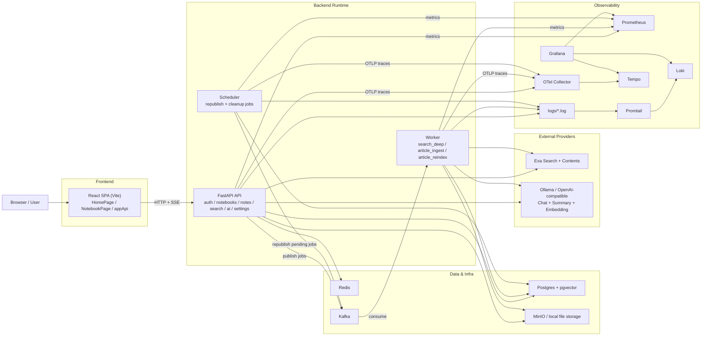
```mermaid
flowchart LR
    Browser["Browser / User"]

    subgraph Frontend["Frontend"]
        SPA["React SPA (Vite)<br/>HomePage / NotebookPage / appApi"]
    end

    subgraph Backend["Backend Runtime"]
        API["FastAPI API<br/>auth / notebooks / notes / search / ai / settings"]
        Worker["Worker<br/>search_deep / article_ingest / article_reindex"]
        Scheduler["Scheduler<br/>republish + cleanup jobs"]
    end

    subgraph Data["Data & Infra"]
        PG["Postgres + pgvector"]
        MinIO["MinIO / local file storage"]
        Redis["Redis"]
        MQ["Kafka"]
    end

    subgraph External["External Providers"]
        Exa["Exa Search + Contents"]
        LLM["Ollama / OpenAI-compatible<br/>Chat + Summary + Embedding"]
    end

    subgraph Observability["Observability"]
        LocalLogs["logs/*.log"]
        Prom["Prometheus"]
        Promtail["Promtail"]
        Loki["Loki"]
        OTel["OTel Collector"]
        Tempo["Tempo"]
        Grafana["Grafana"]
    end

    Browser --> SPA
    SPA -->|"HTTP + SSE"| API

    API --> PG
    API --> MinIO
    API --> Redis
    API --> Exa
    API --> LLM
    API -->|"publish jobs"| MQ

    MQ -->|"consume"| Worker
    Worker --> PG
    Worker --> MinIO
    Worker --> Exa
    Worker --> LLM

    Scheduler --> PG
    Scheduler -->|"republish pending jobs"| MQ

    API --> LocalLogs
    Worker --> LocalLogs
    Scheduler --> LocalLogs

    LocalLogs --> Promtail
    Promtail --> Loki

    API -->|"metrics"| Prom
    Worker -->|"metrics"| Prom
    Scheduler -->|"metrics"| Prom

    API -->|"OTLP traces"| OTel
    Worker -->|"OTLP traces"| OTel
    Scheduler -->|"OTLP traces"| OTel
    OTel --> Tempo

    Grafana --> Prom
    Grafana --> Loki
    Grafana --> Tempo
```

### 2.3 关键调用关系说明

| 发起方    | 调用目标                       | 协议/方式            | 典型用途                                                                |
| --------- | ------------------------------ | -------------------- | ----------------------------------------------------------------------- |
| 前端 SPA  | FastAPI API                    | HTTP JSON            | 登录、Notebook/Notes CRUD、来源搜索、导入、设置                         |
| 前端 SPA  | FastAPI API                    | SSE                  | Chat、Summary 流式输出                                                  |
| API       | Postgres                       | SQLAlchemy Async ORM | 用户、Notebook、Article、SearchSession、Job、Conversation、SummaryCache |
| API       | Exa                            | HTTP                 | inline search、网页结果查询                                             |
| API       | LLM provider                   | HTTP / LangChain     | chat/summary/translation（chat/summary 是关键链路）                     |
| API       | Kafka                          | producer             | 发布 `search_deep`、`article_ingest`、`article_reindex`                 |
| Worker    | Kafka                          | consumer             | 消费异步任务                                                            |
| Worker    | Exa / Trafilatura / 文件解析器 | HTTP / 本地解析      | 获取正文、清洗正文                                                      |
| Worker    | LLM provider                   | HTTP / LangChain     | embedding、必要时正文 fallback                                          |
| Scheduler | Postgres + Kafka               | SQL + producer       | 重发 pending job、清理历史数据                                          |

## 3. 核心数据模型

| 模型                  | 作用                 | 关键字段                                                                                                                   |
| --------------------- | -------------------- | -------------------------------------------------------------------------------------------------------------------------- |
| `Notebook`            | 用户的知识容器       | `user_id`, `title`, `emoji`, `color`                                                                                       |
| `Article`             | 已导入来源的统一实体 | `input_type`, `source_url`, `clean_markdown`, `toc_json`, `parse_status`, `chunk_status`, `index_status`, `article_vector` |
| `ArticleChunk`        | 文章切分后的检索粒度 | `chunk_index`, `heading_title`, `section_path`, `chunk_text`, `chunk_vector`                                               |
| `SearchSession`       | 一次搜索会话         | `query`, `mode`, `execution_mode`, `status`, `provider_name`, `result_count`                                               |
| `SearchResult`        | 搜索结果候选集       | `raw_url`, `canonical_url`, `title`, `description`, `preview_markdown`                                                     |
| `Job`                 | 异步任务实体         | `job_type`, `status`, `attempts`, `payload_json`, `dedupe_key`, `last_error`                                               |
| `SummaryCache`        | 摘要缓存             | `article_id`, `content_hash`, `prompt_version`, `model_provider`, `model_name`, `summary_text`                             |
| `Conversation`        | 对话会话             | `notebook_id`, `current_article_id`, `rolling_summary`, `last_message_at`                                                  |
| `ConversationMessage` | 对话消息             | `conversation_id`, `role`, `route`, `content`, `retrieval_snapshot_json`                                                   |
| `Note`                | 用户笔记             | `notebook_id`, `title`, `content_markdown`, `source_count`                                                                 |

补充说明：

- `Article.article_tsv` 用于全文检索。
- `Article.article_vector` 和 `ArticleChunk.chunk_vector` 用于语义检索。
- `parse_status` 控制正文是否可展示。
- `index_status` / `chunk_status` 控制检索索引是否就绪。
- 设计上已经将“正文 ready”和“索引完成”解耦，正文可展示时不要求 embedding 全部完成。

## 4. 关键流程

本节只画当前代码里真实存在的主链路，重点覆盖：

- Search 的同步执行、深度搜索异步化和轮询回读
- Source 导入到 Ingest 的 parse-ready 边界
- Worker 与 Scheduler 的异步执行与维护动作
- AI Chat 的路由分支与流式输出
- Summary 的缓存命中与未命中

### 4.1 Search 流程

关键入口：

- API: `search/router.py`
- Service: `search/sessions/service.py`
- Async handler: `ingest/articles/worker.py -> process_search_deep()`

#### 4.1.1 流程图

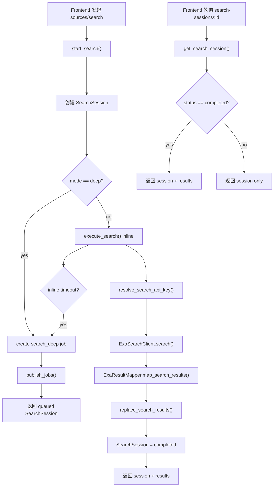
```mermaid
flowchart TD
    A["Frontend 发起 sources/search"] --> B["start_search()"]
    B --> C["创建 SearchSession"]
    C --> D{"mode == deep?"}

    D -->|"yes"| E["create search_deep job"]
    E --> F["publish_jobs()"]
    F --> G["返回 queued SearchSession"]

    D -->|"no"| H["execute_search() inline"]
    H --> I["resolve_search_api_key()"]
    I --> J["ExaSearchClient.search()"]
    J --> K["ExaResultMapper.map_search_results()"]
    K --> L["replace_search_results()"]
    L --> M["SearchSession = completed"]
    M --> N["返回 session + results"]

    H --> O{"inline timeout?"}
    O -->|"yes"| E

    P["Frontend 轮询 search-sessions/:id"] --> Q["get_search_session()"]
    Q --> R{"status == completed?"}
    R -->|"yes"| S["返回 session + results"]
    R -->|"no"| T["返回 session only"]
```

#### 4.1.2 关键时序图

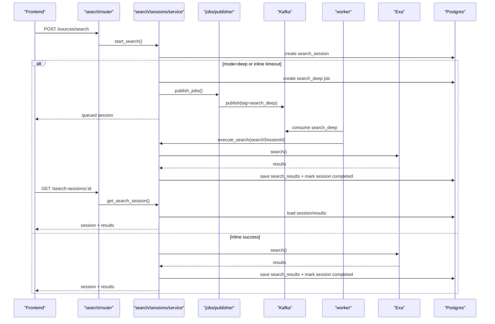
```mermaid
sequenceDiagram
    participant FE as "Frontend"
    participant API as "search/router"
    participant Search as "search/sessions/service"
    participant Jobs as "jobs/publisher"
    participant Kafka as "Kafka"
    participant Worker as "worker"
    participant Exa as "Exa"
    participant DB as "Postgres"

    FE->>API: POST /sources/search
    API->>Search: start_search()
    Search->>DB: create search_session

    alt mode=deep or inline timeout
        Search->>DB: create search_deep job
        Search->>Jobs: publish_jobs()
        Jobs->>Kafka: publish(tag=search_deep)
        Search-->>FE: queued session
        Worker->>Kafka: consume search_deep
        Worker->>Search: execute_search(searchSessionId)
        Search->>Exa: search()
        Exa-->>Search: results
        Search->>DB: save search_results + mark session completed
        FE->>API: GET /search-sessions/:id
        API->>Search: get_search_session()
        Search->>DB: load session/results
        Search-->>FE: session + results
    else inline success
        Search->>Exa: search()
        Exa-->>Search: results
        Search->>DB: save search_results + mark session completed
        Search-->>FE: session + results
    end
```

#### 4.1.3 关键状态

| 模式   | execution_mode | 实际执行位置     | 前端观察方式                 |
| ------ | -------------- | ---------------- | ---------------------------- |
| `fast` | `sync`         | API inline       | 直接拿到 results             |
| `auto` | `sync`         | API inline       | 超时后退化为 queued + 轮询   |
| `deep` | `async`        | Job + Worker     | 先拿 session，再轮询结果     |

#### 4.1.4 `manual_service` 入口流程

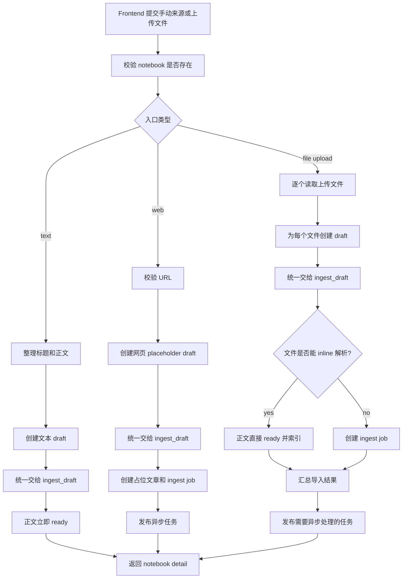
```mermaid
flowchart TD
    A["Frontend 提交手动来源或上传文件"] --> B["校验 notebook 是否存在"]
    B --> C{"入口类型"}

    C -->|"text"| D["整理标题和正文"]
    D --> E["创建文本 draft"]
    E --> F["统一交给 ingest_draft"]
    F --> G["正文立即 ready"]
    G --> H["返回 notebook detail"]

    C -->|"web"| I["校验 URL"]
    I --> J["创建网页 placeholder draft"]
    J --> K["统一交给 ingest_draft"]
    K --> L["创建占位文章和 ingest job"]
    L --> M["发布异步任务"]
    M --> H

    C -->|"file upload"| N["逐个读取上传文件"]
    N --> O["为每个文件创建 draft"]
    O --> P["统一交给 ingest_draft"]
    P --> Q{"文件是否能 inline 解析?"}
    Q -->|"yes"| R["正文直接 ready 并索引"]
    Q -->|"no"| S["创建 ingest job"]
    R --> T["汇总导入结果"]
    S --> T
    T --> U["发布需要异步处理的任务"]
    U --> H
```

#### 4.1.5 `import_service` 入口流程

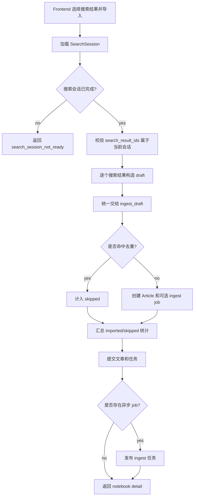
```mermaid
flowchart TD
    A["Frontend 选择搜索结果并导入"] --> B["加载 SearchSession"]
    B --> C{"搜索会话已完成?"}
    C -->|"no"| D["返回 search_session_not_ready"]
    C -->|"yes"| E["校验 search_result_ids 属于当前会话"]
    E --> F["逐个搜索结果构造 draft"]
    F --> G["统一交给 ingest_draft"]
    G --> H{"是否命中去重?"}
    H -->|"yes"| I["计入 skipped"]
    H -->|"no"| J["创建 Article 和可选 ingest job"]
    I --> K["汇总 imported/skipped 统计"]
    J --> K
    K --> L["提交文章和任务"]
    L --> M{"是否存在异步 job?"}
    M -->|"yes"| N["发布 ingest 任务"]
    M -->|"no"| O["直接返回"]
    N --> O["返回 notebook detail"]
```

### 4.2 Source 导入与 Ingest 流程

关键入口：

- Source service: `search/sources/manual_service.py`, `search/sources/import_service.py`
- Draft ingest: `ingest/articles/service.py`
- Async ingest: `ingest/articles/worker.py`

#### 4.2.1 流程图

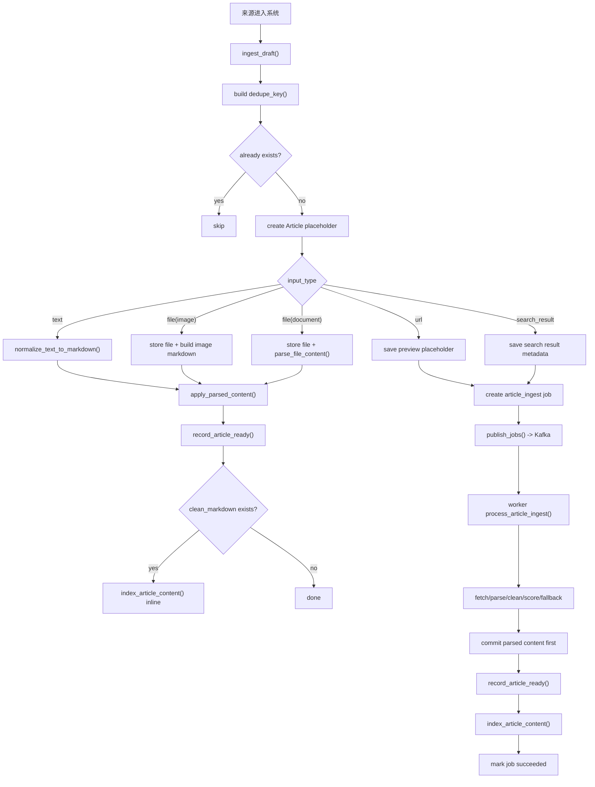
```mermaid
flowchart TD
    A["来源进入系统"] --> B["ingest_draft()"]
    B --> C["build dedupe_key()"]
    C --> D{"already exists?"}
    D -->|"yes"| E["skip"]
    D -->|"no"| F["create Article placeholder"]

    F --> G{"input_type"}
    G -->|"text"| H["normalize_text_to_markdown()"]
    G -->|"file(image)"| I["store file + build image markdown"]
    G -->|"file(document)"| J["store file + parse_file_content()"]
    G -->|"url"| K["save preview placeholder"]
    G -->|"search_result"| L["save search result metadata"]

    H --> M["apply_parsed_content()"]
    I --> M
    J --> M
    K --> N["create article_ingest job"]
    L --> N

    M --> O["record_article_ready()"]
    O --> P{"clean_markdown exists?"}
    P -->|"yes"| Q["index_article_content() inline"]
    P -->|"no"| R["done"]

    N --> S["publish_jobs() -> Kafka"]
    S --> T["worker process_article_ingest()"]
    T --> U["fetch/parse/clean/score/fallback"]
    U --> V["commit parsed content first"]
    V --> W["record_article_ready()"]
    W --> X["index_article_content()"]
    X --> Y["mark job succeeded"]
```

#### 4.2.2 关键时序图

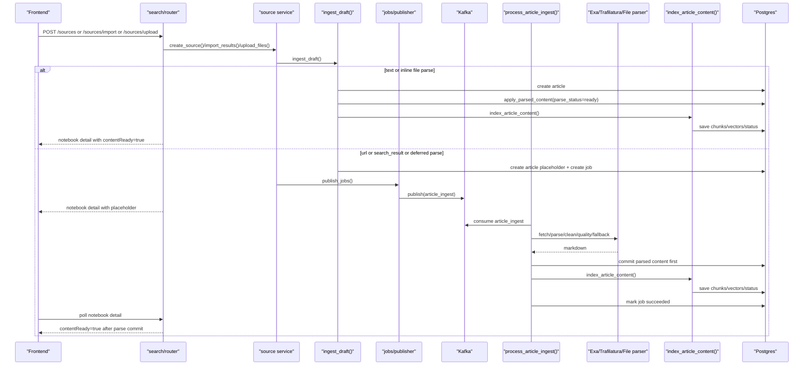
```mermaid
sequenceDiagram
    participant FE as "Frontend"
    participant API as "search/router"
    participant Source as "source service"
    participant Ingest as "ingest_draft()"
    participant Jobs as "jobs/publisher"
    participant Kafka as "Kafka"
    participant Worker as "process_article_ingest()"
    participant Parser as "Exa/Trafilatura/File parser"
    participant Index as "index_article_content()"
    participant DB as "Postgres"

    FE->>API: POST /sources or /sources/import or /sources/upload
    API->>Source: create_source()/import_results()/upload_files()
    Source->>Ingest: ingest_draft()

    alt text or inline file parse
        Ingest->>DB: create article
        Ingest->>DB: apply_parsed_content(parse_status=ready)
        Ingest->>Index: index_article_content()
        Index->>DB: save chunks/vectors/status
        API-->>FE: notebook detail with contentReady=true
    else url or search_result or deferred parse
        Ingest->>DB: create article placeholder + create job
        Source->>Jobs: publish_jobs()
        Jobs->>Kafka: publish(article_ingest)
        API-->>FE: notebook detail with placeholder
        Worker->>Kafka: consume article_ingest
        Worker->>Parser: fetch/parse/clean/quality/fallback
        Parser-->>Worker: markdown
        Worker->>DB: commit parsed content first
        Worker->>Index: index_article_content()
        Index->>DB: save chunks/vectors/status
        Worker->>DB: mark job succeeded
        FE->>API: poll notebook detail
        API-->>FE: contentReady=true after parse commit
    end
```

#### 4.2.3 来源差异

| 来源类型        | 入口              | 正文 ready 时机      | 是否创建 job | 备注                         |
| --------------- | ----------------- | -------------------- | ------------ | ---------------------------- |
| `text`          | `/sources`        | API 内立即完成       | 否           | 文本直接转 Markdown          |
| `file`          | `/sources/upload` | 通常 API 内立即完成  | 视文件类型而定 | 图片直接转图片 Markdown      |
| `url`           | `/sources`        | Worker fetch 后完成  | 是           | 先占位，再抓正文             |
| `search_result` | `/sources/import` | Worker fetch 后完成  | 是           | 先落 Article，再抓正文       |

#### 4.2.4 parse-ready 边界

- `parse_status=ready` 才表示正文可读。
- `chunk_status` 和 `index_status` 是检索就绪状态，不是阅读就绪状态。
- Worker 在 `process_article_ingest()` 里先提交 parsed content，再继续索引；因此 embedding 失败不会让正文重新不可见。

### 4.3 Worker 与 Scheduler 流程

关键入口：

- Worker bootstrap: `workers/run_worker.py`
- Consumer: `infra/mq/consumer.py`
- Handlers: `workers/handlers/__init__.py`
- Scheduler bootstrap: `workers/run_scheduler.py`
- Tick logic: `modules/jobs/scheduler.py`

#### 4.3.1 Worker 流程图

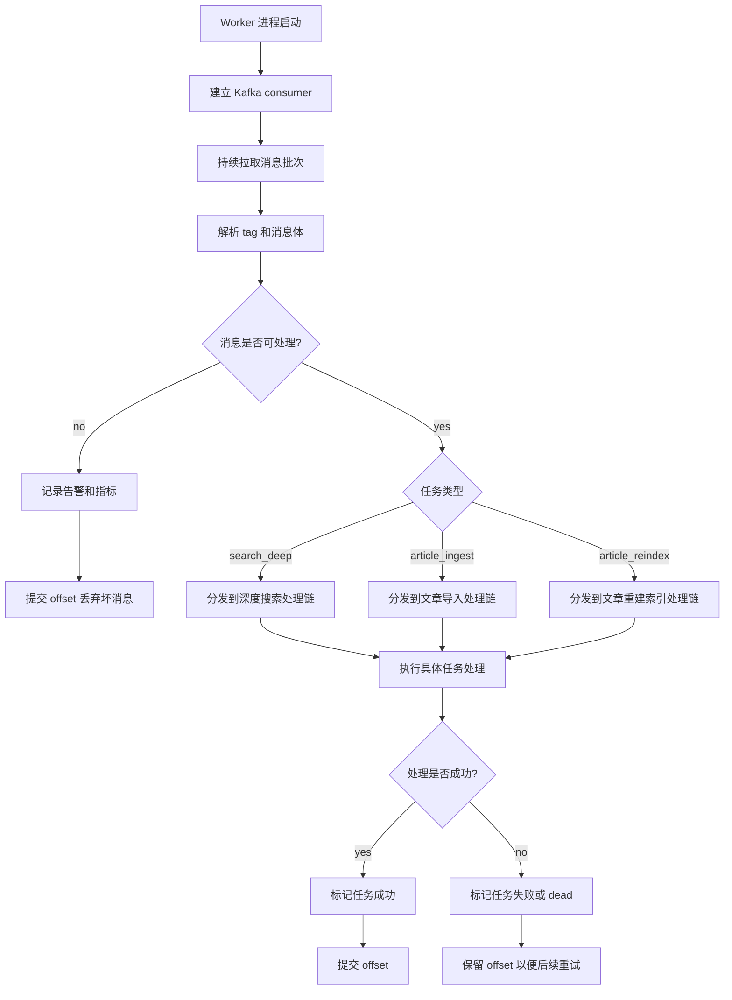
```mermaid
flowchart TD
    A["Worker 进程启动"] --> B["建立 Kafka consumer"]
    B --> C["持续拉取消息批次"]
    C --> D["解析 tag 和消息体"]
    D --> E{"消息是否可处理?"}

    E -->|"no"| F["记录告警和指标"]
    F --> G["提交 offset 丢弃坏消息"]

    E -->|"yes"| H{"任务类型"}
    H -->|"search_deep"| I["分发到深度搜索处理链"]
    H -->|"article_ingest"| J["分发到文章导入处理链"]
    H -->|"article_reindex"| K["分发到文章重建索引处理链"]

    I --> L["执行具体任务处理"]
    J --> L
    K --> L

    L --> M{"处理是否成功?"}
    M -->|"yes"| N["标记任务成功"]
    N --> O["提交 offset"]
    M -->|"no"| P["标记任务失败或 dead"]
    P --> Q["保留 offset 以便后续重试"]
```

#### 4.3.2 `search_deep` 处理流程

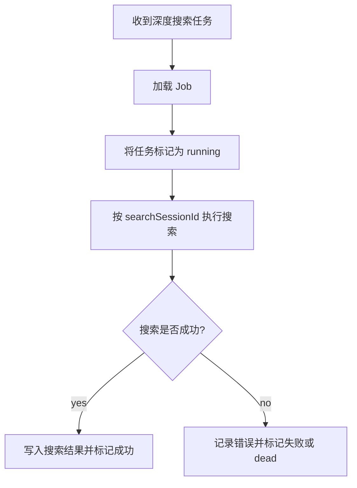
```mermaid
flowchart TD
    A["收到深度搜索任务"] --> B["加载 Job"]
    B --> C["将任务标记为 running"]
    C --> D["按 searchSessionId 执行搜索"]
    D --> E{"搜索是否成功?"}
    E -->|"yes"| F["写入搜索结果并标记成功"]
    E -->|"no"| G["记录错误并标记失败或 dead"]
```

#### 4.3.3 `article_ingest` 处理流程

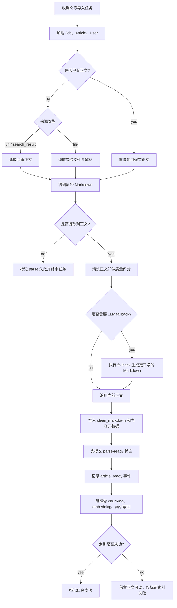
```mermaid
flowchart TD
    A["收到文章导入任务"] --> B["加载 Job、Article、User"]
    B --> C{"是否已有正文?"}
    C -->|"yes"| D["直接复用现有正文"]
    C -->|"no"| E{"来源类型"}

    E -->|"url / search_result"| F["抓取网页正文"]
    E -->|"file"| G["读取存储文件并解析"]

    F --> H["得到原始 Markdown"]
    G --> H
    D --> H

    H --> I{"是否提取到正文?"}
    I -->|"no"| J["标记 parse 失败并结束任务"]
    I -->|"yes"| K["清洗正文并做质量评分"]

    K --> L{"是否需要 LLM fallback?"}
    L -->|"yes"| M["执行 fallback 生成更干净的 Markdown"]
    L -->|"no"| N["沿用当前正文"]
    M --> N

    N --> O["写入 clean_markdown 和内容元数据"]
    O --> P["先提交 parse-ready 状态"]
    P --> Q["记录 article_ready 事件"]
    Q --> R["继续做 chunking、embedding、索引写回"]
    R --> S{"索引是否成功?"}
    S -->|"yes"| T["标记任务成功"]
    S -->|"no"| U["保留正文可读，仅标记索引失败"]
```

#### 4.3.4 `article_reindex` 处理流程

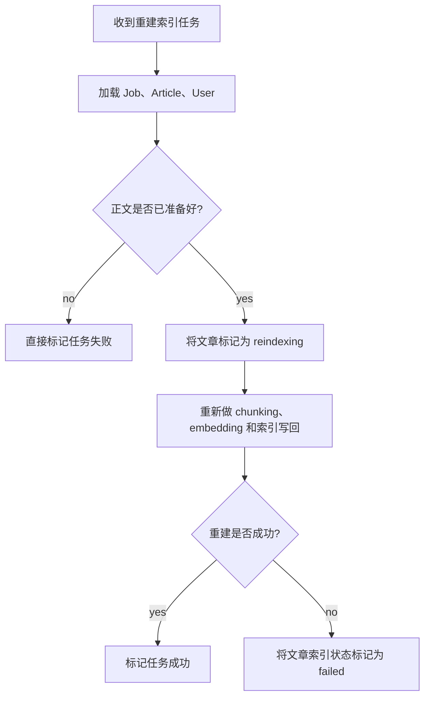
```mermaid
flowchart TD
    A["收到重建索引任务"] --> B["加载 Job、Article、User"]
    B --> C{"正文是否已准备好?"}
    C -->|"no"| D["直接标记任务失败"]
    C -->|"yes"| E["将文章标记为 reindexing"]
    E --> F["重新做 chunking、embedding 和索引写回"]
    F --> G{"重建是否成功?"}
    G -->|"yes"| H["标记任务成功"]
    G -->|"no"| I["将文章索引状态标记为 failed"]
```

#### 4.3.5 Scheduler 流程图

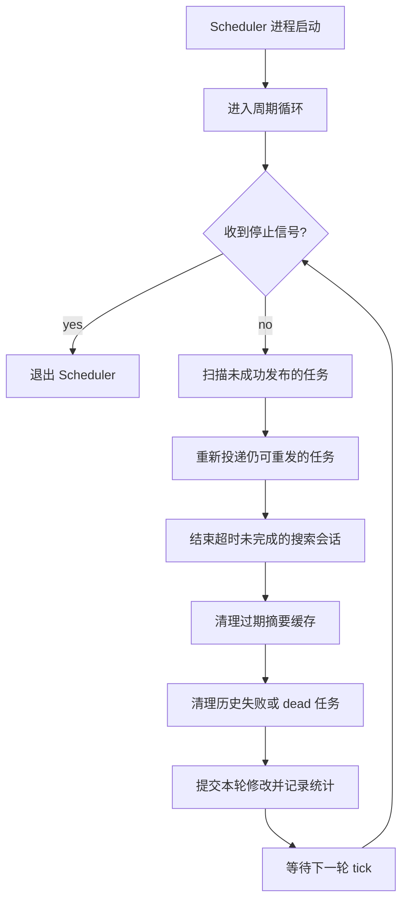
```mermaid
flowchart TD
    A["Scheduler 进程启动"] --> B["进入周期循环"]
    B --> C{"收到停止信号?"}
    C -->|"yes"| D["退出 Scheduler"]
    C -->|"no"| E["扫描未成功发布的任务"]
    E --> F["重新投递仍可重发的任务"]
    F --> G["结束超时未完成的搜索会话"]
    G --> H["清理过期摘要缓存"]
    H --> I["清理历史失败或 dead 任务"]
    I --> J["提交本轮修改并记录统计"]
    J --> K["等待下一轮 tick"]
    K --> C
```

#### 4.3.6 Job 发布与消费时序图

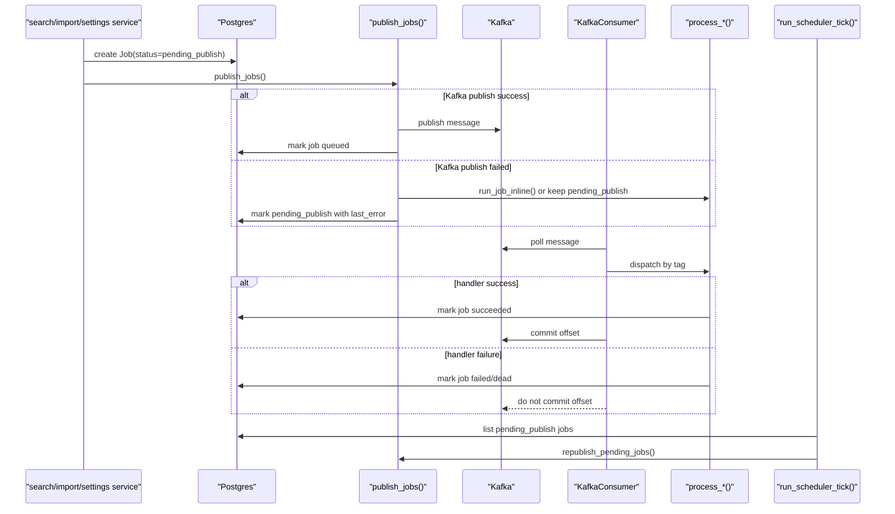
```mermaid
sequenceDiagram
    participant Service as "search/import/settings service"
    participant DB as "Postgres"
    participant Publisher as "publish_jobs()"
    participant Kafka as "Kafka"
    participant Worker as "KafkaConsumer"
    participant Handler as "process_*()"
    participant Scheduler as "run_scheduler_tick()"

    Service->>DB: create Job(status=pending_publish)
    Service->>Publisher: publish_jobs()

    alt Kafka publish success
        Publisher->>Kafka: publish message
        Publisher->>DB: mark job queued
    else Kafka publish failed
        Publisher->>Handler: run_job_inline() or keep pending_publish
        Publisher->>DB: mark pending_publish with last_error
    end

    Worker->>Kafka: poll message
    Worker->>Handler: dispatch by tag
    alt handler success
        Handler->>DB: mark job succeeded
        Worker->>Kafka: commit offset
    else handler failure
        Handler->>DB: mark job failed/dead
        Worker-->>Kafka: do not commit offset
    end

    Scheduler->>DB: list pending_publish jobs
    Scheduler->>Publisher: republish_pending_jobs()
```

#### 4.3.7 Scheduler 维护动作

| 动作                      | 函数                              | 作用                                    |
| ------------------------- | --------------------------------- | --------------------------------------- |
| `republished_jobs`        | `republish_pending_jobs()`        | 把 `pending_publish` 的 job 重新推回 MQ |
| `expired_search_sessions` | `expire_stale_search_sessions()`  | 结束超时未完成的搜索会话                |
| `cleaned_summary_cache`   | `cleanup_expired_summary_cache()` | 清理过期摘要缓存                        |
| `cleaned_failed_jobs`     | `cleanup_failed_jobs()`           | 清理历史 `failed/dead` job              |

### 4.4 AI Chat 流程

关键入口：

- API: `ai/router.py`
- Chat service: `ai/chat/service.py`
- Context builder: `ai/chat/context_builder.py`
- Route decision: `retrieval/router.py`

#### 4.4.1 `ai/chat` 包内文件职责

| 文件 | 主要职责 |
| --- | --- |
| `service.py` | Chat 的同步/流式入口编排，负责调用 prepare、模型执行、finalize、SSE 输出 |
| `context_builder.py` | 组装 `PreparedChatReply`，串起 notebook 校验、conversation、route、retrieval、prompt |
| `conversation.py` | conversation 的创建/复用、user/assistant message 追加、最近历史窗口读取 |
| `repo.py` | `Conversation` / `ConversationMessage` 的数据库读写 |
| `message_mapper.py` | 把 ORM message 转成 LangChain `HumanMessage` / `AIMessage` |
| `rollup.py` | 长会话历史压缩，把旧消息总结进 `rolling_summary`，并删除溢出消息 |
| `runner.py` | 非流式 `ainvoke()` 包装和 LLM 调用错误统一处理 |
| `result_serializer.py` | 组装 API 响应、citation、retrieval snapshot |
| `models.py` | `Conversation` 和 `ConversationMessage` 的表结构 |
| `schemas.py` | `ChatRequest` 请求体定义 |

#### 4.4.2 总流程图

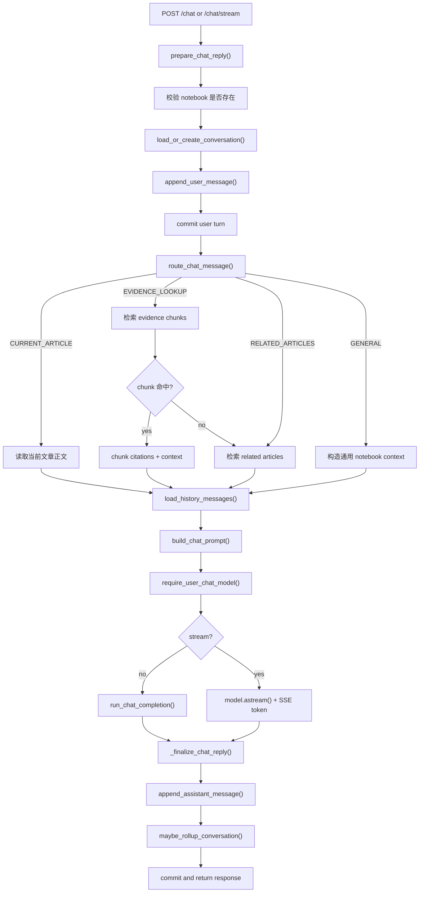
```mermaid
flowchart TD
    A["POST /chat or /chat/stream"] --> B["prepare_chat_reply()"]
    B --> C["校验 notebook 是否存在"]
    C --> D["load_or_create_conversation()"]
    D --> E["append_user_message()"]
    E --> F["commit user turn"]
    F --> G["route_chat_message()"]

    G -->|"CURRENT_ARTICLE"| H["读取当前文章正文"]
    G -->|"EVIDENCE_LOOKUP"| I["检索 evidence chunks"]
    G -->|"RELATED_ARTICLES"| J["检索 related articles"]
    G -->|"GENERAL"| K["构造通用 notebook context"]

    I --> L{"chunk 命中?"}
    L -->|"yes"| M["chunk citations + context"]
    L -->|"no"| J

    H --> N["load_history_messages()"]
    M --> N
    J --> N
    K --> N

    N --> O["build_chat_prompt()"]
    O --> P["require_user_chat_model()"]
    P --> Q{"stream?"}
    Q -->|"no"| R["run_chat_completion()"]
    Q -->|"yes"| S["model.astream() + SSE token"]
    R --> T["_finalize_chat_reply()"]
    S --> T
    T --> U["append_assistant_message()"]
    U --> V["maybe_rollup_conversation()"]
    V --> W["commit and return response"]
```

#### 4.4.3 Conversation 与历史管理流程图

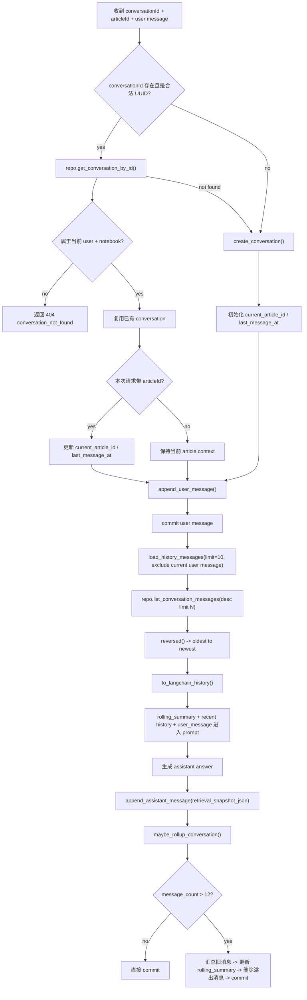
```mermaid
flowchart TD
    A["收到 conversationId + articleId + user message"] --> B{"conversationId 存在且是合法 UUID?"}
    B -->|"yes"| C["repo.get_conversation_by_id()"]
    B -->|"no"| D["create_conversation()"]

    C --> E{"属于当前 user + notebook?"}
    E -->|"no"| F["返回 404 conversation_not_found"]
    E -->|"yes"| G["复用已有 conversation"]
    C -->|"not found"| D

    D --> H["初始化 current_article_id / last_message_at"]
    G --> I{"本次请求带 articleId?"}
    I -->|"yes"| J["更新 current_article_id / last_message_at"]
    I -->|"no"| K["保持当前 article context"]
    H --> L["append_user_message()"]
    J --> L
    K --> L

    L --> M["commit user message"]
    M --> N["load_history_messages(limit=10, exclude current user message)"]
    N --> O["repo.list_conversation_messages(desc limit N)"]
    O --> P["reversed() -> oldest to newest"]
    P --> Q["to_langchain_history()"]
    Q --> R["rolling_summary + recent history + user_message 进入 prompt"]
    R --> S["生成 assistant answer"]
    S --> T["append_assistant_message(retrieval_snapshot_json)"]
    T --> U["maybe_rollup_conversation()"]
    U --> V{"message_count > 12?"}
    V -->|"no"| W["直接 commit"]
    V -->|"yes"| X["汇总旧消息 -> 更新 rolling_summary -> 删除溢出消息 -> commit"]
```

#### 4.4.4 流式回答关键时序图

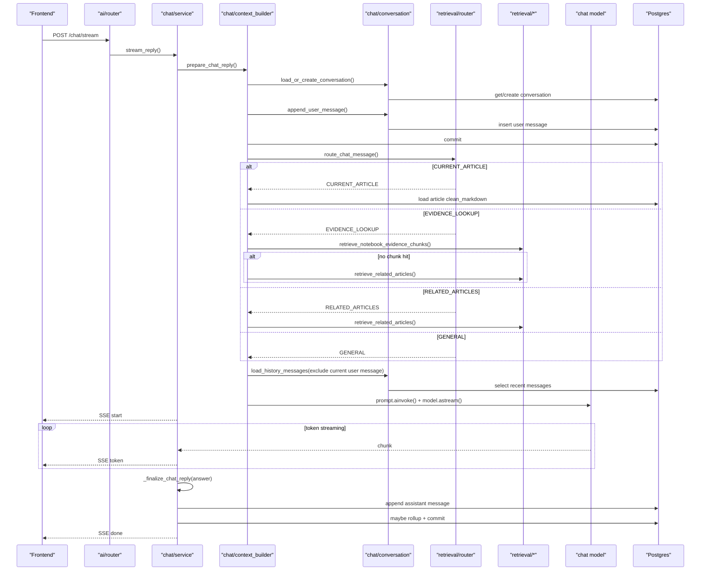
```mermaid
sequenceDiagram
    participant FE as "Frontend"
    participant API as "ai/router"
    participant Chat as "chat/service"
    participant Context as "chat/context_builder"
    participant Conv as "chat/conversation"
    participant Route as "retrieval/router"
    participant Retrieval as "retrieval/*"
    participant LLM as "chat model"
    participant DB as "Postgres"

    FE->>API: POST /chat/stream
    API->>Chat: stream_reply()
    Chat->>Context: prepare_chat_reply()
    Context->>Conv: load_or_create_conversation()
    Conv->>DB: get/create conversation
    Context->>Conv: append_user_message()
    Conv->>DB: insert user message
    Context->>DB: commit
    Context->>Route: route_chat_message()

    alt CURRENT_ARTICLE
        Route-->>Context: CURRENT_ARTICLE
        Context->>DB: load article clean_markdown
    else EVIDENCE_LOOKUP
        Route-->>Context: EVIDENCE_LOOKUP
        Context->>Retrieval: retrieve_notebook_evidence_chunks()
        alt no chunk hit
            Context->>Retrieval: retrieve_related_articles()
        end
    else RELATED_ARTICLES
        Route-->>Context: RELATED_ARTICLES
        Context->>Retrieval: retrieve_related_articles()
    else GENERAL
        Route-->>Context: GENERAL
    end

    Context->>Conv: load_history_messages(exclude current user message)
    Conv->>DB: select recent messages
    Context->>LLM: prompt.ainvoke() + model.astream()
    Chat-->>FE: SSE start
    loop token streaming
        LLM-->>Chat: chunk
        Chat-->>FE: SSE token
    end
    Chat->>Chat: _finalize_chat_reply(answer)
    Chat->>DB: append assistant message
    Chat->>DB: maybe rollup + commit
    Chat-->>FE: SSE done
```

#### 4.4.5 历史管理时序图

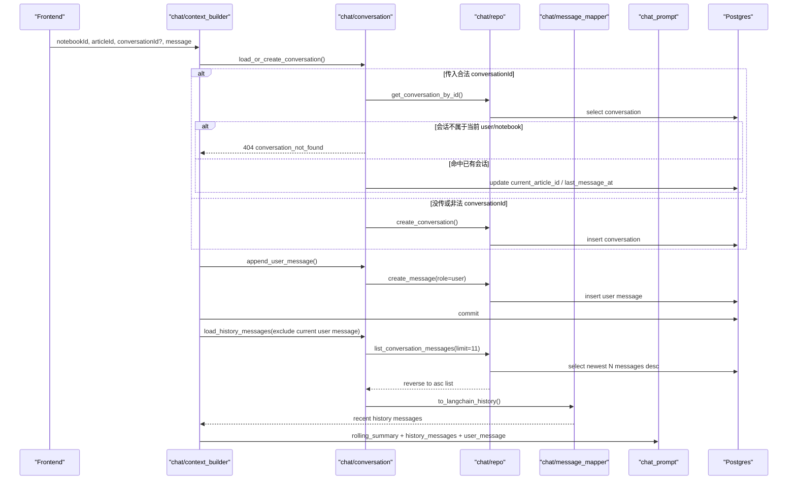
```mermaid
sequenceDiagram
    participant FE as "Frontend"
    participant Context as "chat/context_builder"
    participant Conv as "chat/conversation"
    participant Repo as "chat/repo"
    participant Mapper as "chat/message_mapper"
    participant Prompt as "chat_prompt"
    participant DB as "Postgres"

    FE->>Context: notebookId, articleId, conversationId?, message
    Context->>Conv: load_or_create_conversation()
    alt 传入合法 conversationId
        Conv->>Repo: get_conversation_by_id()
        Repo->>DB: select conversation
        alt 会话不属于当前 user/notebook
            Conv-->>Context: 404 conversation_not_found
        else 命中已有会话
            Conv->>DB: update current_article_id / last_message_at
        end
    else 没传或非法 conversationId
        Conv->>Repo: create_conversation()
        Repo->>DB: insert conversation
    end

    Context->>Conv: append_user_message()
    Conv->>Repo: create_message(role=user)
    Repo->>DB: insert user message
    Context->>DB: commit

    Context->>Conv: load_history_messages(exclude current user message)
    Conv->>Repo: list_conversation_messages(limit=11)
    Repo->>DB: select newest N messages desc
    Repo-->>Conv: reverse to asc list
    Conv->>Mapper: to_langchain_history()
    Mapper-->>Context: recent history messages

    Context->>Prompt: rolling_summary + history_messages + user_message
```

#### 4.4.6 历史压缩（rollup）时序图

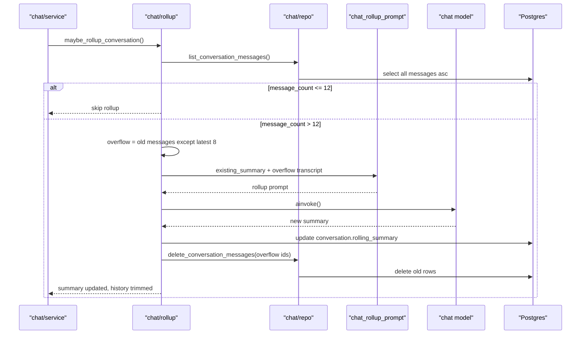
```mermaid
sequenceDiagram
    participant Chat as "chat/service"
    participant Rollup as "chat/rollup"
    participant Repo as "chat/repo"
    participant Prompt as "chat_rollup_prompt"
    participant LLM as "chat model"
    participant DB as "Postgres"

    Chat->>Rollup: maybe_rollup_conversation()
    Rollup->>Repo: list_conversation_messages()
    Repo->>DB: select all messages asc

    alt message_count <= 12
        Rollup-->>Chat: skip rollup
    else message_count > 12
        Rollup->>Rollup: overflow = old messages except latest 8
        Rollup->>Prompt: existing_summary + overflow transcript
        Prompt-->>Rollup: rollup prompt
        Rollup->>LLM: ainvoke()
        LLM-->>Rollup: new summary
        Rollup->>DB: update conversation.rolling_summary
        Rollup->>Repo: delete_conversation_messages(overflow ids)
        Repo->>DB: delete old rows
        Rollup-->>Chat: summary updated, history trimmed
    end
```

#### 4.4.7 Route 语义

| route              | 主要上下文来源                             | 典型场景               |
| ------------------ | ------------------------------------------ | ---------------------- |
| `CURRENT_ARTICLE`  | 当前文章 `clean_markdown`                  | 问当前文章正文         |
| `RELATED_ARTICLES` | `retrieve_related_articles()`              | 问相似文章、横向比较   |
| `EVIDENCE_LOOKUP`  | `retrieve_notebook_evidence_chunks()` 优先 | 问证据、出处、引用     |
| `GENERAL`          | notebook 标题 + 当前文章标题               | 通用问题或不依赖正文   |

### 4.5 AI Summary 流程

关键入口：

- API: `ai/router.py`
- Summary service: `ai/summary/service.py`
- Summary workflow: `ai/summary/workflow.py`

#### 4.5.1 流程图

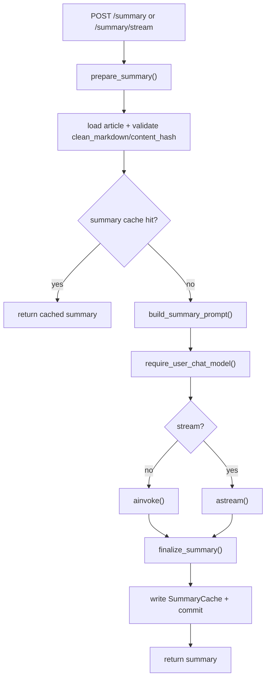
```mermaid
flowchart TD
    A["POST /summary or /summary/stream"] --> B["prepare_summary()"]
    B --> C["load article + validate clean_markdown/content_hash"]
    C --> D{"summary cache hit?"}
    D -->|"yes"| E["return cached summary"]
    D -->|"no"| F["build_summary_prompt()"]
    F --> G["require_user_chat_model()"]
    G --> H{"stream?"}
    H -->|"no"| I["ainvoke()"]
    H -->|"yes"| J["astream()"]
    I --> K["finalize_summary()"]
    J --> K
    K --> L["write SummaryCache + commit"]
    L --> M["return summary"]
```

#### 4.5.2 关键时序图

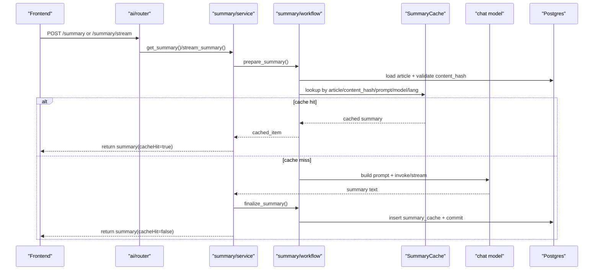
```mermaid
sequenceDiagram
    participant FE as "Frontend"
    participant API as "ai/router"
    participant Summary as "summary/service"
    participant Workflow as "summary/workflow"
    participant Cache as "SummaryCache"
    participant LLM as "chat model"
    participant DB as "Postgres"

    FE->>API: POST /summary or /summary/stream
    API->>Summary: get_summary()/stream_summary()
    Summary->>Workflow: prepare_summary()
    Workflow->>DB: load article + validate content_hash
    Workflow->>Cache: lookup by article/content_hash/prompt/model/lang

    alt cache hit
        Cache-->>Workflow: cached summary
        Workflow-->>Summary: cached_item
        Summary-->>FE: return summary(cacheHit=true)
    else cache miss
        Workflow->>LLM: build prompt + invoke/stream
        LLM-->>Summary: summary text
        Summary->>Workflow: finalize_summary()
        Workflow->>DB: insert summary_cache + commit
        Summary-->>FE: return summary(cacheHit=false)
    end
```

#### 4.5.3 Summary Cache 维度

| 维度              | 作用                 |
| ----------------- | -------------------- |
| `article_id`      | 锁定同一篇文章       |
| `content_hash`    | 正文变更即失效       |
| `prompt_version`  | prompt 变更即失效    |
| `model_provider`  | 模型提供方变化即失效 |
| `model_name`      | 模型变化即失效       |
| `output_language` | 输出语言变化即失效   |

## 5. 观测与运行时链路

虽然本文重点不是 observability，但它已经是系统架构的一部分，值得单独说明。

### 5.1 观测架构表

| 类别      | 来源                                                                             | 采集方式                     | 最终落点                |
| --------- | -------------------------------------------------------------------------------- | ---------------------------- | ----------------------- |
| Metrics   | API / Worker / Scheduler                                                         | `/metrics` HTTP scrape       | Prometheus              |
| Logs      | `logs/backend.log`, `logs/worker.log`, `logs/scheduler.log`, `logs/frontend.log` | Promtail tail 文件           | Loki                    |
| Traces    | API / Worker / Scheduler                                                         | OTLP                         | OTel Collector -> Tempo |
| Dashboard | Grafana                                                                          | 读 Prometheus / Loki / Tempo | Grafana                 |

### 5.2 常见调试入口

| 你想看什么           | 推荐入口                                                |
| -------------------- | ------------------------------------------------------- |
| 某段链路整体是否变慢 | Grafana Dashboard 看 P95 / Count                        |
| 某个请求做了什么     | Loki 按 `request_id` / `article_id` / `job_id` 查日志   |
| 某个异步 job 卡在哪  | Loki 查 `job_id`，看 `worker.*` / `ingest.*` 结构化日志 |
| 某个调用跨组件耗时   | Tempo 查 `trace_id`                                     |

## 6. 一页速查：用户动作到后端调用链

| 用户动作            | 前端入口         | API 路由                                               | Service / Worker 链路                                                            |
| ------------------- | ---------------- | ------------------------------------------------------ | -------------------------------------------------------------------------------- |
| 登录                | `LoginPage`      | `/auth/login`                                          | `auth.service.login()`                                                           |
| 打开首页            | `HomePage`       | `/auth/me`, `/notebooks`                               | `auth`, `notebooks.service.list_notebooks()`                                     |
| 打开笔记本          | `NotebookPage`   | `/notebooks/{id}`                                      | `notebooks.service.get_notebook_detail()`                                        |
| 搜索来源            | `SourcePanel`    | `/notebooks/{id}/sources/search`                       | `search.service_search.start_search()`                                           |
| 导入搜索结果        | `SourcePanel`    | `/notebooks/{id}/sources/import`                       | `search.service_import.import_results()` -> `ingest_draft()` -> `publish_jobs()` |
| 手动添加网页        | `AddSourceModal` | `/notebooks/{id}/sources`                              | `search.service_manual.create_source()` -> `article_ingest job`                  |
| 上传文件            | `AddSourceModal` | `/notebooks/{id}/sources/upload`                       | `search.service_manual.upload_files()` -> 即时解析/索引                          |
| AI 对话             | `NotebookPage`   | `/notebooks/{id}/chat/stream`                          | `ai.chat_service.stream_reply()`                                                 |
| AI 摘要             | `NotebookPage`   | `/notebooks/{id}/articles/{article_id}/summary/stream` | `ai.summary_service.stream_summary()`                                            |
| 修改 embedding 配置 | `SettingsModal`  | `/settings`                                            | `settings.service.update_settings()` -> `article_reindex job`                    |

## 7. 总结

这个项目的核心不是单个 CRUD API，而是一套“同步交互 + 异步 ingest / reindex + 检索增强生成”的组合式架构：

- 前端通过 REST + SSE 驱动交互。
- FastAPI 承担同步响应与任务编排。
- Kafka 把长任务从请求线程移走。
- Worker 负责正文获取、解析、索引、重建。
- Postgres 同时承担主数据、全文检索、向量检索。
- Exa 与 LLM provider 分别承担“找来源”和“生成/embedding”。
- Grafana 侧把 metrics、logs、traces 汇到一起做排障。

如果后续要继续扩展文档，最值得补的两部分是：

1. 数据库 ER 图
2. 设置模块里 provider/runtime 解析矩阵（chat/search/embedding 三套默认与用户覆盖逻辑）
