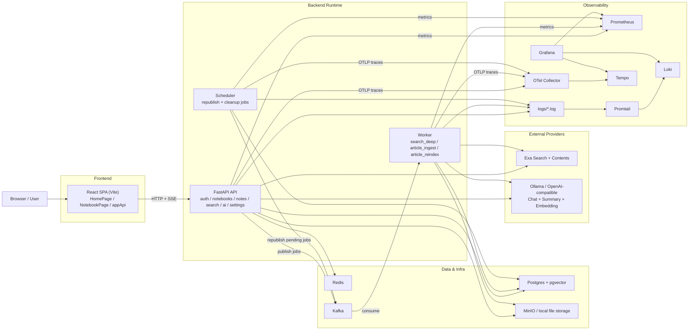
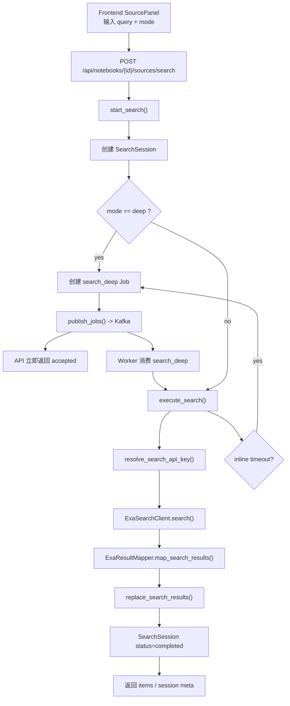
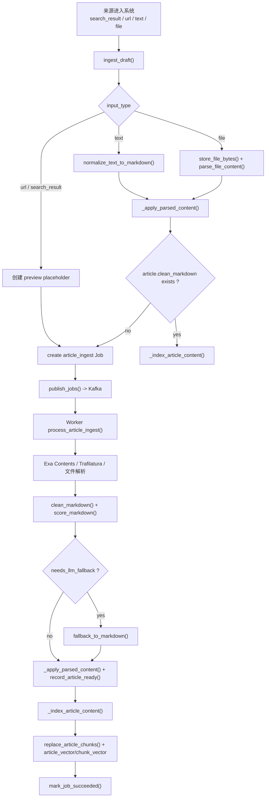
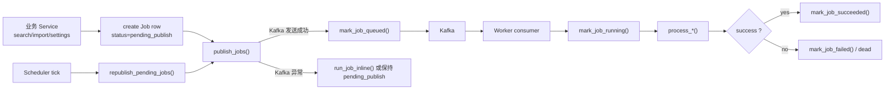
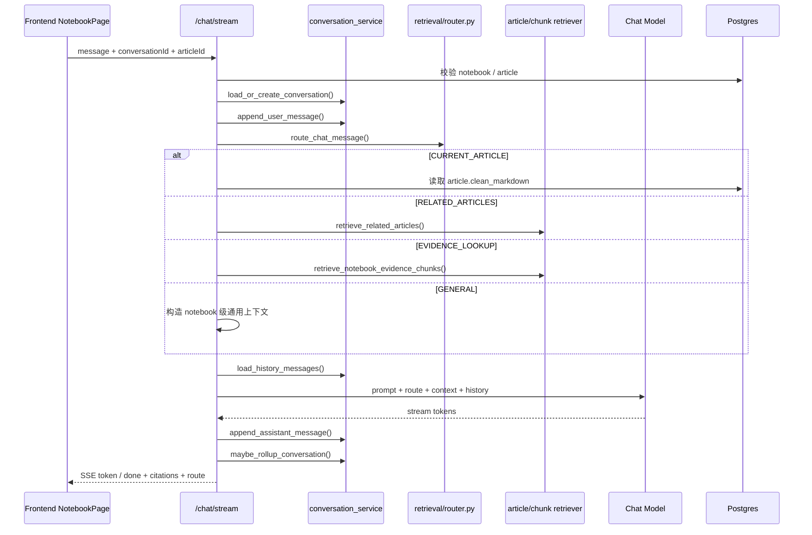
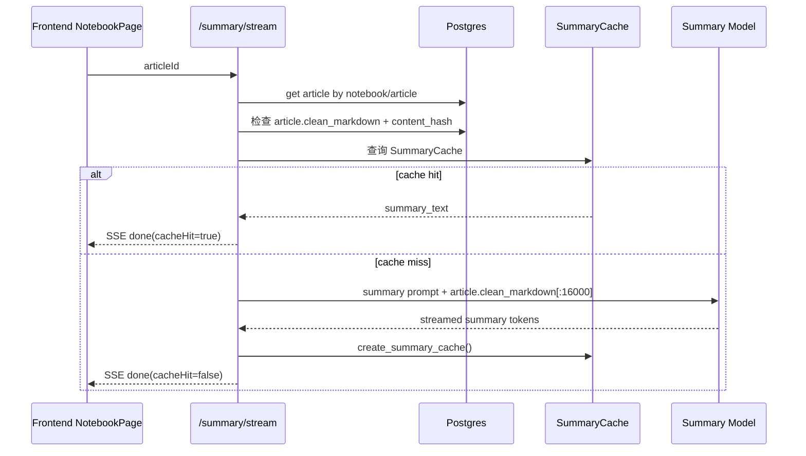

# NotebookLM 项目架构与关键流程梳理

- 后端 API：`backend/app/main.py` 与各模块 router/service
- 异步执行：`backend/app/workers`
- 基础设施：`docker-compose.yml`、`docker/*`
- 观测：Prometheus / Loki / Tempo / Grafana

## 1. 组件总览

| 层         | 组件                                | 关键文件                                                                                                                            | 主要职责                                                            | 依赖                                                     |
| ---------- | ----------------------------------- | ----------------------------------------------------------------------------------------------------------------------------------- | ------------------------------------------------------------------- | -------------------------------------------------------- |
| 客户端     | React SPA                           | `frontend/src/App.jsx`, `frontend/src/pages/HomePage.jsx`, `frontend/src/pages/NotebookPage.jsx`, `frontend/src/services/appApi.js` | 登录、笔记本列表、文章阅读、来源搜索、导入、AI Chat、Summary、Notes | FastAPI API                                              |
| API 层     | FastAPI                             | `backend/app/main.py`                                                                                                               | 路由注册、依赖注入、中间件、生命周期、统一观测初始化                | Postgres、Redis、Kafka、对象存储、LLM/Search provider |
| 认证       | Auth 模块                           | `backend/app/modules/auth/*`                                                                                                        | 注册、登录、token 校验、用户读取                                    | Postgres                                                 |
| 业务聚合   | Notebook / Notes                    | `backend/app/modules/notebooks/*`, `backend/app/modules/notes/*`                                                                    | 笔记本与笔记 CRUD、Notebook detail 聚合                             | Postgres                                                 |
| 搜索       | Search 模块                         | `backend/app/modules/search/*`                                                                                                      | Exa 搜索、搜索会话、搜索结果、来源导入、手动来源创建、文件上传      | Exa、Postgres、对象存储、Kafka                           |
| 导入与索引 | Ingest 模块                         | `backend/app/modules/ingest/*`                                                                                                      | 正文解析、清洗、质量评分、chunking、embedding、向量/全文索引        | Exa Contents、Trafilatura、LLM、pgvector、对象存储       |
| 对话与摘要 | AI 模块                             | `backend/app/modules/ai/*`, `backend/app/modules/retrieval/*`                                                                       | Chat Router、RAG 检索、Conversation、Summary Cache、SSE 流式输出    | LLM Provider、Postgres、pgvector                         |
| 异步任务   | Jobs 模块                           | `backend/app/modules/jobs/*`                                                                                                        | Job 建模、发布、重发、inline fallback                               | Kafka、Worker、Scheduler                                 |
| Worker     | 异步消费者                          | `backend/app/workers/run_worker.py`                                                                                                 | 消费 `search_deep`、`article_ingest`、`article_reindex`             | Kafka、Postgres、Exa、LLM、对象存储                      |
| Scheduler  | 定时任务                            | `backend/app/workers/run_scheduler.py`, `backend/app/modules/jobs/scheduler.py`                                                     | 重发 pending job、清理失败 job、清理过期会话/摘要缓存               | Postgres、Kafka                                          |
| 存储       | Postgres + pgvector                 | `docker-compose.yml`, `backend/app/modules/notebooks/models.py`                                                                     | 主业务数据、全文检索、向量检索                                      | API、Worker、Scheduler                                   |
| 文件存储   | MinIO / 本地文件                    | `backend/app/modules/search/file_storage.py`, `backend/app/infra/storage/object_store.py`                                           | 上传文件落盘/对象存储、文件回放与下载                               | API、Worker                                              |
| 队列       | Kafka + kafka-exporter              | `backend/app/infra/mq/*`, `docker-compose.yml`, `docker/prometheus/prometheus.yml`                                                  | Job 传递、消费者位点管理、lag/offset 指标暴露                       | API、Worker、Scheduler                                   |
| 搜索提供方 | Exa                                 | `backend/app/infra/providers/exa/*`                                                                                                 | 搜索结果与网页正文抓取                                              | API、Worker                                              |
| 模型提供方 | Ollama / OpenAI-compatible          | `backend/app/modules/ai/langchain_factory.py`, `backend/app/modules/ingest/embedder.py`                                             | Chat、Summary、Embedding                                            | API、Worker                                              |
| 观测       | Prometheus / Loki / Tempo / Grafana | `docker/prometheus/prometheus.yml`, `docker/promtail/config.yaml`, `backend/app/infra/telemetry/*`                                  | 指标、日志、Trace 聚合与展示                                        | API、Worker、Scheduler                                   |

## 2. 总体架构图

### 2.1 ASCII 架构图

```text
┌─────────────────────────────────────────────────────────────────────────────┐
│                                User / Browser                              │
└──────────────┬──────────────────────────────────────────────────────────────┘
               │ HTTP / SSE
               v
┌─────────────────────────────────────────────────────────────────────────────┐
│                         React SPA (Vite, frontend)                         │
│  - HomePage                                                                │
│  - NotebookPage                                                            │
│  - SourcePanel / SettingsModal / NoteModal                                 │
│  - appApi.js                                                               │
└──────────────┬──────────────────────────────────────────────────────────────┘
               │ /api/*
               v
┌─────────────────────────────────────────────────────────────────────────────┐
│                            FastAPI Backend API                              │
│  routers: auth / notebooks / notes / search / ai / settings / health       │
│                                                                             │
│  sync service calls:                                                        │
│  - Auth / Notebook / Notes CRUD                                             │
│  - Search session creation + Exa inline search                              │
│  - Text / File immediate ingest                                              │
│  - Chat / Summary SSE                                                        │
│  - Settings update + optional reindex scheduling                             │
└───────┬─────────────────┬──────────────────┬──────────────────┬────────────┘
        │                 │                  │                  │
        │ SQL             │ Files            │ Search / Content │ LLM / Embed
        v                 v                  v                  v
┌──────────────┐   ┌──────────────┐   ┌──────────────┐   ┌──────────────────┐
│ Postgres +   │   │ MinIO /      │   │ Exa          │   │ Ollama /         │
│ pgvector     │   │ local files  │   │ Search/      │   │ OpenAI-compatible│
│              │   │              │   │ Contents     │   │ Chat/Embedding   │
└──────┬───────┘   └──────────────┘   └──────────────┘   └──────────────────┘
       │
       │ create jobs / mark queued
       v
┌─────────────────────────────────────────────────────────────────────────────┐
│                             Kafka + kafka-exporter                           │
└──────────────┬──────────────────────────────────────────────────────────────┘
               │ consume
               v
┌─────────────────────────────────────────────────────────────────────────────┐
│                                   Worker                                    │
│  jobs:                                                                      │
│  - search_deep                                                              │
│  - article_ingest                                                           │
│  - article_reindex                                                          │
│                                                                             │
│  worker side effects:                                                       │
│  - fetch Exa Contents / Trafilatura / file parser                           │
│  - clean + score + optional LLM fallback                                    │
│  - chunk + embedding + replace article_chunks                               │
│  - update job / article state                                               │
└──────────────┬──────────────────────────────────────────────────────────────┘
               │
               v
┌─────────────────────────────────────────────────────────────────────────────┐
│                                 Scheduler                                   │
│  - republish pending jobs                                                   │
│  - expire stale search sessions                                             │
│  - cleanup summary cache                                                    │
│  - cleanup failed/dead jobs                                                 │
└─────────────────────────────────────────────────────────────────────────────┘


Observability sidecar path:

API / Worker / Scheduler
   ├─ metrics -> Prometheus
   ├─ logs/*.log -> Promtail -> Loki
   └─ OTLP traces -> OTel Collector -> Tempo

Grafana reads Prometheus + Loki + Tempo
```

### 2.2 Mermaid 架构图



### 2.3 关键调用关系说明

| 发起方    | 调用目标                       | 协议/方式            | 典型用途                                                                |
| --------- | ------------------------------ | -------------------- | ----------------------------------------------------------------------- |
| 前端 SPA  | FastAPI API                    | HTTP JSON            | 登录、Notebook/Notes CRUD、来源搜索、导入、设置                         |
| 前端 SPA  | FastAPI API                    | SSE                  | Chat、Summary 流式输出                                                  |
| API       | Postgres                       | SQLAlchemy Async ORM | 用户、Notebook、Article、SearchSession、Job、Conversation、SummaryCache |
| API       | Exa                            | HTTP                 | inline search、网页结果查询                                             |
| API       | LLM provider                   | HTTP / LangChain     | chat/summary/translation（chat/summary 是关键链路）                     |
| API       | Kafka                          | producer             | 发布 `search_deep`、`article_ingest`、`article_reindex`                 |
| Worker    | Kafka                          | consumer             | 消费异步任务                                                            |
| Worker    | Exa / Trafilatura / 文件解析器 | HTTP / 本地解析      | 获取正文、清洗正文                                                      |
| Worker    | LLM provider                   | HTTP / LangChain     | embedding、必要时正文 fallback                                          |
| Scheduler | Postgres + Kafka               | SQL + producer       | 重发 pending job、清理历史数据                                          |

## 3. 核心数据模型

| 模型                  | 作用                 | 关键字段                                                                                                                   |
| --------------------- | -------------------- | -------------------------------------------------------------------------------------------------------------------------- |
| `Notebook`            | 用户的知识容器       | `user_id`, `title`, `emoji`, `color`                                                                                       |
| `Article`             | 已导入来源的统一实体 | `input_type`, `source_url`, `clean_markdown`, `toc_json`, `parse_status`, `chunk_status`, `index_status`, `article_vector` |
| `ArticleChunk`        | 文章切分后的检索粒度 | `chunk_index`, `heading_title`, `section_path`, `chunk_text`, `chunk_vector`                                               |
| `SearchSession`       | 一次搜索会话         | `query`, `mode`, `execution_mode`, `status`, `provider_name`, `result_count`                                               |
| `SearchResult`        | 搜索结果候选集       | `raw_url`, `canonical_url`, `title`, `description`, `preview_markdown`                                                     |
| `Job`                 | 异步任务实体         | `job_type`, `status`, `attempts`, `payload_json`, `dedupe_key`, `last_error`                                               |
| `SummaryCache`        | 摘要缓存             | `article_id`, `content_hash`, `prompt_version`, `model_provider`, `model_name`, `summary_text`                             |
| `Conversation`        | 对话会话             | `notebook_id`, `current_article_id`, `rolling_summary`, `last_message_at`                                                  |
| `ConversationMessage` | 对话消息             | `conversation_id`, `role`, `route`, `content`, `retrieval_snapshot_json`                                                   |
| `Note`                | 用户笔记             | `notebook_id`, `title`, `content_markdown`, `source_count`                                                                 |

补充说明：

- `Article.article_tsv` 用于全文检索。
- `Article.article_vector` 和 `ArticleChunk.chunk_vector` 用于语义检索。
- `parse_status` 控制正文是否可展示。
- `index_status` / `chunk_status` 控制检索索引是否就绪。
- 设计上已经将“正文 ready”和“索引完成”解耦，正文可展示时不要求 embedding 全部完成。

## 4. 关键流程

### 4.1 搜索流程

#### 4.1.1 目标

用户在 Notebook 内发起搜索后，系统需要：

1. 创建 `SearchSession`
2. 调用 Exa 搜索
3. 写入 `SearchResult`
4. 对 `deep` 模式改走异步 job
5. 将结果返回前端供后续导入

#### 4.1.2 Mermaid 流程图



#### 4.1.3 步骤说明

| 步骤                     | 所在组件      | 关键函数                                          | 输出                                   |
| ------------------------ | ------------- | ------------------------------------------------- | -------------------------------------- |
| 校验 notebook 与 Exa key | API/Search    | `start_search()`                                  | 可执行搜索的上下文                     |
| 创建搜索会话             | API/Search    | `create_search_session()`                         | `SearchSession(status=queued/running)` |
| 同步搜索                 | API/Search    | `execute_search()`                                | inline 结果                            |
| 深度搜索异步化           | Jobs + Worker | `_enqueue_search_job()` / `process_search_deep()` | 由 worker 完成 Exa 搜索                |
| Exa 结果标准化           | API/Search    | `ExaResultMapper.map_search_results()`            | `SearchResult[]`                       |
| 结果持久化               | API/Search    | `replace_search_results()`                        | 搜索结果可轮询                         |

#### 4.1.4 状态与模式

| 模式   | execution_mode | 执行方式     | 说明                   |
| ------ | -------------- | ------------ | ---------------------- |
| `fast` | `sync`         | API inline   | 默认短链路             |
| `auto` | `sync`         | API inline   | 超时会 fallback 为异步 |
| `deep` | `async`        | Job + Worker | API 只返回 accepted    |

### 4.2 导入与 Ingest 流程

#### 4.2.1 目标

系统需要把不同来源统一落成 `Article`，然后根据来源类型决定：

- 是立即得到正文并索引
- 还是先创建占位 article，再由 worker 异步抓正文

#### 4.2.2 Mermaid 流程图



#### 4.2.3 来源类型差异

| 来源类型        | 入口              | 是否立即得到正文 | 是否创建 job | 说明                               |
| --------------- | ----------------- | ---------------- | ------------ | ---------------------------------- |
| `text`          | `/sources`        | 是               | 否           | 直接把文本规范化成 Markdown        |
| `file`          | `/sources/upload` | 是               | 通常否       | 上传后直接解析文件内容并索引       |
| `url`           | `/sources`        | 否               | 是           | 先建 placeholder，再异步抓正文     |
| `search_result` | `/sources/import` | 否               | 是           | 先导入搜索结果，再由 worker 抓正文 |

#### 4.2.4 文章状态说明

| 字段           | 典型值                                              | 含义                    |
| -------------- | --------------------------------------------------- | ----------------------- |
| `parse_status` | `queued / ready / failed`                           | 正文解析是否完成        |
| `chunk_status` | `not_started / processing / ready / failed / stale` | chunk 切分是否完成      |
| `index_status` | `not_started / processing / ready / failed / stale` | 检索索引是否完成        |
| `ingested_at`  | datetime                                            | 第一次正文 ready 的时间 |

关键点：

- 前端看到“正文准备中”，本质上看的是 `parse_status != ready`。
- 一旦 worker 把 `parse_status=ready` 提交，正文就可以展示。
- embedding 或 chunking 失败不会把正文回滚成不可见，只会影响检索能力。

### 4.3 Job 系统与调度流程

#### 4.3.1 目标

Job 层负责把长耗时/可重试任务从 API 线程移走，同时提供：

- job 建模
- Kafka 发布
- worker 消费
- scheduler 重发 pending job
- 配置变化触发 reindex

#### 4.3.2 Mermaid 流程图



#### 4.3.3 Job 类型说明

| job_type          | 触发位置                                              | 处理函数                    | 作用                                          |
| ----------------- | ----------------------------------------------------- | --------------------------- | --------------------------------------------- |
| `search_deep`     | 搜索模式为 `deep`，或 inline 搜索超时 fallback        | `process_search_deep()`     | 异步完成 Exa 搜索并写入 `SearchResult`        |
| `article_ingest`  | 导入 `url` / `search_result`，或其他尚未 ready 的来源 | `process_article_ingest()`  | 抓正文、清洗、质量评分、必要时 fallback、索引 |
| `article_reindex` | 设置里 embedding profile 变更                         | `process_article_reindex()` | 清旧向量、重新 chunk + embedding              |

#### 4.3.4 Scheduler 维护动作

| 动作                      | 来源函数                          | 作用                                    |
| ------------------------- | --------------------------------- | --------------------------------------- |
| `republished_jobs`        | `republish_pending_jobs()`        | 把 `pending_publish` 的 job 重新推回 MQ |
| `expired_search_sessions` | `expire_stale_search_sessions()`  | 让过期搜索会话自动收尾                  |
| `cleaned_summary_cache`   | `cleanup_expired_summary_cache()` | 清理过期摘要缓存                        |
| `cleaned_failed_jobs`     | `cleanup_failed_jobs()`           | 清理历史失败/死亡 job                   |

#### 4.3.5 与设置的关系

用户在设置里修改 embedding provider / model / apiUrl 时：

1. `update_settings()` 计算 embedding profile 是否变化
2. 若变化且已有已解析文章，会要求确认重建索引
3. 系统会清空 `Article.article_vector` 和 `ArticleChunk`
4. 将文章状态标为 `stale`
5. 为每篇文章创建 `article_reindex` job

也就是说，设置页并不直接重建索引，而是通过 job 系统异步完成。

### 4.4 Chat 流程

#### 4.4.1 目标

Chat 不是单一路由，而是先做“问题路由”，然后再决定使用：

- 当前文章正文
- 相关文章
- 证据 chunk
- 通用问题上下文

#### 4.4.2 Mermaid 时序图



#### 4.4.3 Chat Route 说明

| route              | 使用场景                 | 主要上下文来源                             | 典型输出             |
| ------------------ | ------------------------ | ------------------------------------------ | -------------------- |
| `CURRENT_ARTICLE`  | 用户明确在问当前文章     | `article.clean_markdown`                   | 当前文章问答         |
| `RELATED_ARTICLES` | 用户问相似/相关内容      | `retrieve_related_articles()`              | 跨文章总结、比较     |
| `EVIDENCE_LOOKUP`  | 用户要原文、证据、出处   | `retrieve_notebook_evidence_chunks()` 优先 | chunk 级证据引用     |
| `GENERAL`          | 通用问题、产品问法、寒暄 | notebook + current article 标题级上下文    | 不依赖正文的直接回答 |

#### 4.4.4 Chat 的持久化结果

| 持久化对象                            | 内容                                           |
| ------------------------------------- | ---------------------------------------------- |
| `Conversation`                        | 当前会话归属 notebook/article、rolling_summary |
| `ConversationMessage(role=user)`      | 用户提问                                       |
| `ConversationMessage(role=assistant)` | 模型回答、route、retrieval snapshot            |

### 4.5 Summary 流程

#### 4.5.1 目标

Summary 需要基于文章正文生成摘要，同时尽量复用缓存，避免重复调模型。

#### 4.5.2 Mermaid 时序图



#### 4.5.3 Summary Cache Key

缓存并不是只按 `article_id` 命中，而是按以下维度共同决定：

| 维度              | 作用                 |
| ----------------- | -------------------- |
| `article_id`      | 同一篇文章           |
| `content_hash`    | 文章正文变了就失效   |
| `prompt_version`  | prompt 改版后失效    |
| `model_provider`  | 模型提供方变化后失效 |
| `model_name`      | 模型变化后失效       |
| `output_language` | 输出语言变化后失效   |

因此 Summary Cache 的策略是“强一致地复用相同输入”。

## 5. 观测与运行时链路

虽然本文重点不是 observability，但它已经是系统架构的一部分，值得单独说明。

### 5.1 观测架构表

| 类别      | 来源                                                                             | 采集方式                     | 最终落点                |
| --------- | -------------------------------------------------------------------------------- | ---------------------------- | ----------------------- |
| Metrics   | API / Worker / Scheduler                                                         | `/metrics` HTTP scrape       | Prometheus              |
| Logs      | `logs/backend.log`, `logs/worker.log`, `logs/scheduler.log`, `logs/frontend.log` | Promtail tail 文件           | Loki                    |
| Traces    | API / Worker / Scheduler                                                         | OTLP                         | OTel Collector -> Tempo |
| Dashboard | Grafana                                                                          | 读 Prometheus / Loki / Tempo | Grafana                 |

### 5.2 常见调试入口

| 你想看什么           | 推荐入口                                                |
| -------------------- | ------------------------------------------------------- |
| 某段链路整体是否变慢 | Grafana Dashboard 看 P95 / Count                        |
| 某个请求做了什么     | Loki 按 `request_id` / `article_id` / `job_id` 查日志   |
| 某个异步 job 卡在哪  | Loki 查 `job_id`，看 `worker.*` / `ingest.*` 结构化日志 |
| 某个调用跨组件耗时   | Tempo 查 `trace_id`                                     |

## 6. 一页速查：用户动作到后端调用链

| 用户动作            | 前端入口         | API 路由                                               | Service / Worker 链路                                                            |
| ------------------- | ---------------- | ------------------------------------------------------ | -------------------------------------------------------------------------------- |
| 登录                | `LoginPage`      | `/auth/login`                                          | `auth.service.login()`                                                           |
| 打开首页            | `HomePage`       | `/auth/me`, `/notebooks`                               | `auth`, `notebooks.service.list_notebooks()`                                     |
| 打开笔记本          | `NotebookPage`   | `/notebooks/{id}`                                      | `notebooks.service.get_notebook_detail()`                                        |
| 搜索来源            | `SourcePanel`    | `/notebooks/{id}/sources/search`                       | `search.service_search.start_search()`                                           |
| 导入搜索结果        | `SourcePanel`    | `/notebooks/{id}/sources/import`                       | `search.service_import.import_results()` -> `ingest_draft()` -> `publish_jobs()` |
| 手动添加网页        | `AddSourceModal` | `/notebooks/{id}/sources`                              | `search.service_manual.create_source()` -> `article_ingest job`                  |
| 上传文件            | `AddSourceModal` | `/notebooks/{id}/sources/upload`                       | `search.service_manual.upload_files()` -> 即时解析/索引                          |
| AI 对话             | `NotebookPage`   | `/notebooks/{id}/chat/stream`                          | `ai.chat_service.stream_reply()`                                                 |
| AI 摘要             | `NotebookPage`   | `/notebooks/{id}/articles/{article_id}/summary/stream` | `ai.summary_service.stream_summary()`                                            |
| 修改 embedding 配置 | `SettingsModal`  | `/settings`                                            | `settings.service.update_settings()` -> `article_reindex job`                    |

## 7. 总结

这个项目的核心不是单个 CRUD API，而是一套“同步交互 + 异步 ingest / reindex + 检索增强生成”的组合式架构：

- 前端通过 REST + SSE 驱动交互。
- FastAPI 承担同步响应与任务编排。
- Kafka 把长任务从请求线程移走。
- Worker 负责正文获取、解析、索引、重建。
- Postgres 同时承担主数据、全文检索、向量检索。
- Exa 与 LLM provider 分别承担“找来源”和“生成/embedding”。
- Grafana 侧把 metrics、logs、traces 汇到一起做排障。

如果后续要继续扩展文档，最值得补的两部分是：

1. 数据库 ER 图
2. 设置模块里 provider/runtime 解析矩阵（chat/search/embedding 三套默认与用户覆盖逻辑）
