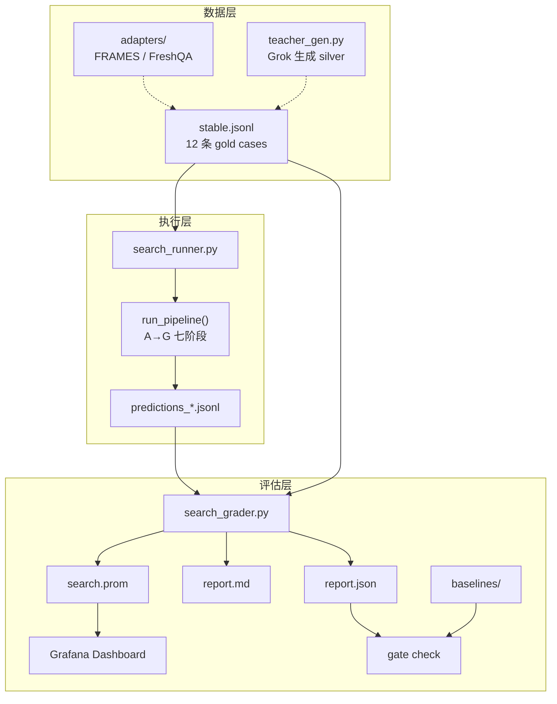
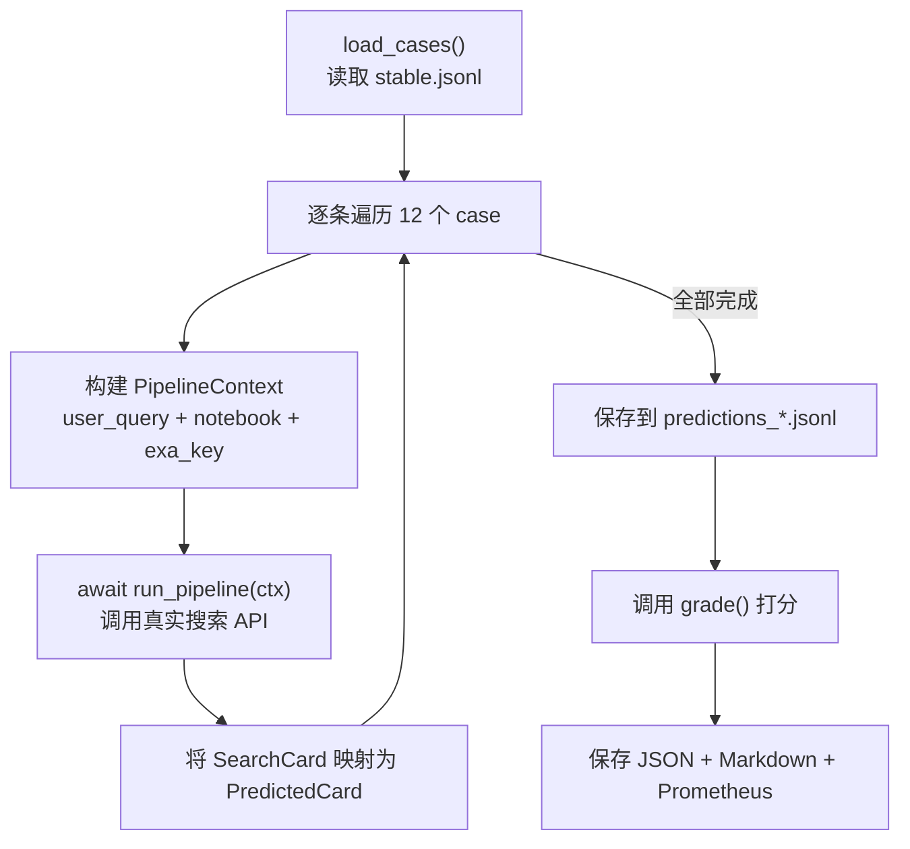
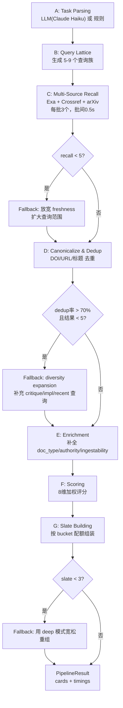

# Search Benchmark 全流程详解

整个 benchmark 由三层组成：**数据层**（定义"什么是好结果"）、**执行层**（跑真实 pipeline）、**评估层**（打分+报告+门禁）。

## 全局数据流



---

## 第一步：数据准备

### Gold Case 结构（`backend/evals/cases/search/stable.jsonl`）

每条 case 是一行 JSON，包含：

```json
{
  "case_id": "search-001",
  "user_task": "研究 transformer 架构在 NLP 中的核心原理和最新进展",
  "notebook_context": {
    "notebook_title": "Transformer 研究",
    "existing_article_titles": [],
    "existing_article_urls": []
  },
  "search_mode": "deep",
  "gold_source_pool": [
    {
      "url": "https://arxiv.org/abs/1706.03762",
      "title": "Attention Is All You Need",
      "facet": "primary",
      "authority": "tier1",
      "relevance_grade": 3
    }
  ],
  "gold_coverage_facets": ["overview", "primary", "recent", "critique"],
  "tags": ["cs", "academic", "en"]
}
```

核心思路：**不是定义唯一正确答案，而是定义"高价值候选集合"**。pipeline 找到其中任何一个就算 hit。

当前有 12 条内部 gold case，覆盖：

- 学术 CS（transformer、LLM agent、幻觉研究）
- 生物医学（AI 临床诊断、药物发现）
- 政策法规（EU AI Act）
- 工程实践（K8s operator、向量数据库对比）
- 中文任务、时效性任务、对比任务

---

## 第二步：Pipeline 执行

当你运行 `./scripts/benchmark.sh run search stable` 时，执行链路是：

```
benchmark.sh → search_runner.py → run_pipeline() → 真实 API 调用
```

### search_runner.py 的主流程



对每条 case，runner 做这些事：

1. **构建 PipelineContext**：把 case 的 `user_task` 作为 `user_query`，`notebook_context` 作为 `NotebookContext`，从 `.env` 读 `exa_default_api_key`
2. **调用 `run_pipeline(ctx)`**：这是真实的 A→G 七阶段 pipeline，会发出真实的 Exa / Crossref / arXiv API 请求
3. **映射结果**：将 pipeline 返回的 `SearchCard` 列表转为 `PredictedCard`（去掉内部字段，保留可评估字段）
4. **记录耗时**：每个 stage 的耗时都保存在 `elapsed_stages` 里

### run_pipeline 七阶段 + 三层 fallback



**Stage A (Task Parsing)** 的模型选择逻辑：

- 如果 `.env` 中 `SEARCH_USE_LLM_TASK_PARSER=true` 且 `LITE_LLM_API_KEY` 存在 → 用 Claude Haiku（30s timeout）
- 如果只有 `GROK_API_KEY` → 用 Grok
- 如果 LLM 调用失败 → 自动 fallback 到规则解析
- 如果 `SEARCH_USE_LLM_TASK_PARSER=false` → 直接用规则

**Stage C (Recall)** 的限速策略：

- 每次并发最多 3 个 query family
- 批次之间等待 0.5s
- Crossref 请求带 `mailto` header 提升配额

---

## 第三步：评分（Grading）

grader 拿到 12 条 case 和 12 条 prediction，逐条计算 7 个指标。

### 匹配逻辑

grader 需要判断"pipeline 返回的结果 X 是否命中 gold source Y"。匹配策略是两层：

1. **URL 精确匹配**：规范化 URL（去 scheme/trailing slash/大小写），如果一致则命中
2. **域名+标题模糊匹配**：同一个域名下，标题相似度 >= 0.8（SequenceMatcher ratio）也算命中
3. **纯标题匹配**：相似度 >= 0.65 也算命中，但 relevance_grade 打 8 折

### 7 个指标详解

| 指标 | 含义 | 计算方式 |
|------|------|---------|
| **nDCG@10** | 排序质量 | 对 slate 前 10 个结果，每个位置的 gain = 命中的 gold source 的 relevance_grade（0-3），除以 ideal DCG（gold pool 按 grade 降序排的 DCG） |
| **Recall@10** | 找全率 | gold_source_pool 中有多少比例被 top 10 结果命中 |
| **Coverage@10** | 视角覆盖率 | gold_coverage_facets 中有多少比例被 top 10 结果覆盖（通过 source_type_badge 和 query_roles 判断 facet） |
| **Authority-weighted nDCG@10** | 权威性加权排序 | 和 nDCG 类似，但 gain 乘以权威系数（tier1=1.5, tier2=1.0, tier3=0.6） |
| **Novelty@10** | 新颖度 | top 10 结果中，不在 notebook 已有 URL 列表里的比例 |
| **Avg / P95 Latency** | 延迟 | 从 elapsed_stages 求和或取 elapsed_total_ms |
| **Empty Slate Rate** | 空结果率 | 返回 0 条结果的 case 占比 |

### 聚合

12 条 case 的指标做简单平均，得到 aggregate metrics。

---

## 第四步：报告输出

grader 产出三种格式的报告：

### 1. JSON 报告（`search_report_*.json`）

完整结构化数据，包含 aggregate 和每条 case 的详细结果（命中了哪些 gold URL、漏掉了哪些）。

### 2. Markdown 报告（`search_report_*.md`）

人可读的表格报告，用 `./scripts/benchmark.sh show reports` 查看。

### 3. Prometheus 指标（`reports/prometheus/search.prom`）

```
notebooklm_benchmark_metric{benchmark="search",profile="stable",metric_group="metrics",metric_name="ndcg_at_k"} 0.75
notebooklm_benchmark_metric{benchmark="search",profile="stable",metric_group="metrics",metric_name="recall_at_k"} 0.6
...
```

label 格式和 `docker/grafana/dashboards/benchmark-dashboard.json` 完全匹配，Prometheus 抓取后 Grafana 直接显示。

---

## 第五步：基线保存与门禁

### 保存基线

```bash
./scripts/benchmark.sh save-baseline search
```

把最新的 `search_report_*.json` 复制到 `backend/evals/baselines/search/search_baseline_*.json`。

### 门禁检查

```bash
./scripts/benchmark.sh gate search
```

比较最新 report 和最新 baseline，对 `ndcg_at_10`、`recall_at_10`、`coverage_at_10` 三个核心指标检查：**如果当前值 < baseline * 0.95（允许 5% 波动），判定为 FAIL**。

这可以接入 CI，防止 pipeline 改动导致质量回退。

---

## 第六步：grade-only 模式

```bash
./scripts/benchmark.sh run search stable --grade-only
```

跳过 Stage C-G 的 API 调用，直接从 `predictions/search/` 读取最近一次的 prediction 文件，只跑 grader。用于：

- 调整 gold case 标注后快速验证
- 调整 grader 评分逻辑后快速验证
- 不消耗 API 配额

---

## 文件结构总览

```
backend/evals/
├── schema.py                          # 所有 Pydantic 数据模型
├── search_runner.py                   # 执行入口：加载 case → 跑 pipeline → 存 prediction → 打分
├── search_grader.py                   # 评分引擎：7 个指标 + Prometheus 导出
├── teacher_gen.py                     # 用 Grok 批量生成 silver cases
├── adapters/
│   ├── frames.py                      # FRAMES 公开数据集 → JSONL 适配
│   └── freshqa.py                     # FreshQA 适配
├── cases/search/
│   └── stable.jsonl                   # 12 条 gold cases（人工标注）
├── datasets/search/                   # 适配器输出的公开数据集
├── predictions/search/                # pipeline 执行结果快照
├── baselines/search/                  # 基线快照
└── reports/
    ├── search_report_*.json           # 完整报告
    ├── search_report_*.md             # 人可读报告
    └── prometheus/search.prom         # Grafana 指标
```

---

## CLI 命令速查

```bash
# 验证 cases 格式
./scripts/benchmark.sh build-datasets search

# 跑完整 benchmark（需要 Exa API key，约 6 分钟）
./scripts/benchmark.sh run search stable

# 只做 grading（已有 predictions 时，秒级完成）
./scripts/benchmark.sh run search stable --grade-only

# 查看最新报告
./scripts/benchmark.sh show reports

# 保存当前结果为基线
./scripts/benchmark.sh save-baseline search

# 回归门禁检查
./scripts/benchmark.sh gate search

# 生成 teacher silver 数据（用 Grok）
cd backend && python -m evals.teacher_gen

# 开启 LLM task parsing（在 .env 中设置）
# SEARCH_USE_LLM_TASK_PARSER=true
```
