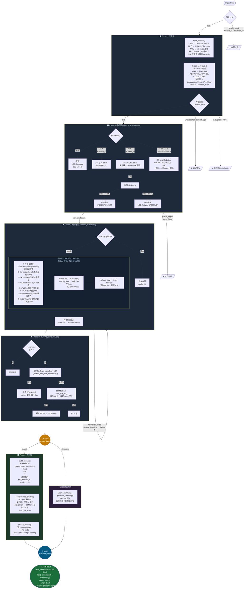
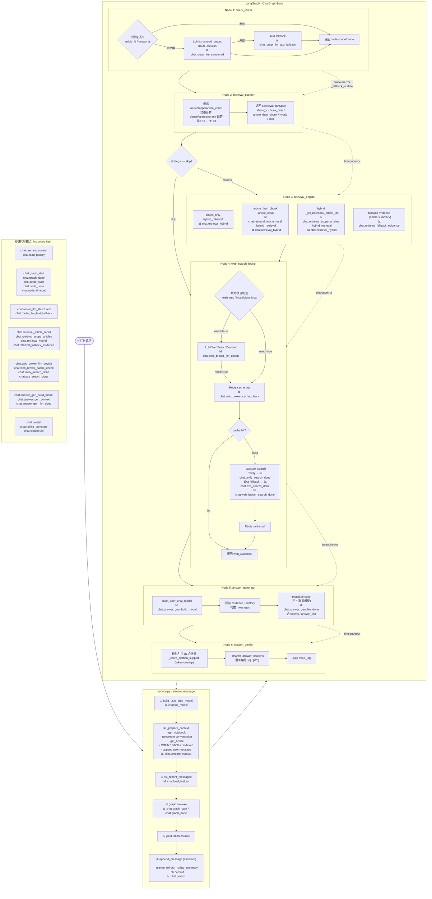

## Summary

```mermaid

flowchart TD

    START([调用 generate_summary]) --> HASH[计算 content_hash\n构造 redis_key / lock_key]

    HASH --> LOCK[获取生成锁\nacquire lock]

    LOCK -- "📊 summary.lock_acquired\nelapsed_ms" --> REDIS_GET

    subgraph Phase1["Phase 1 — 缓存层查找"]

        REDIS_GET[Redis GET\nget_json redis_key]

        REDIS_GET -- "📊 summary.redis_cache_check\nelapsed_ms · hit" --> REDIS_HIT{Redis 命中?}

        REDIS_HIT -- 是 & 可用 --> CACHE_RETURN([返回缓存摘要\ncached=True])

        REDIS_HIT -- 否 --> DB_CHECK[DB 精确查找\nrepo.get_cached_summary]

        DB_CHECK -- "📊 summary.db_cache_check\nelapsed_ms · hit" --> DB_HIT{DB 命中?}

        DB_HIT -- 是 & 可用 --> SET_REDIS1[写入 Redis 缓存\n_set_summary_cache]

        SET_REDIS1 --> CACHE_RETURN

        DB_HIT -- 否 & language=zh --> ZH_CHECK[DB 最新缓存 any language\nrepo.get_latest_cached_summary]

        ZH_CHECK -- "📊 summary.zh_latest_cache_check\nelapsed_ms · found" --> ZH_HIT{有可复用缓存?}

        ZH_HIT -- 需要翻译 --> TRANSLATE[LLM 翻译为中文\n_translate_to_chinese]

        TRANSLATE -- "📊 summary.zh_translate_done\nelapsed_ms" --> ZH_DONE

        ZH_HIT -- 已是中文 --> ZH_DONE[写入 Redis 缓存]

        ZH_DONE --> CACHE_RETURN

        ZH_HIT -- 无可用缓存 --> LANGGRAPH_START

        DB_HIT -- 否 & language≠zh --> LANGGRAPH_START

    end

    subgraph Phase2["Phase 2 — LangGraph 执行 (timeout=150s)"]

        LANGGRAPH_START -- "📊 summary.langgraph_start\ncontent_chars · language" --> N1

        N1["Node 1: analyze_content\n• 文章类型识别\n• token估算 / code_ratio\n• 选 model_tier & strategy"]

        N1 -- "📊 summary.node_analyze_content\nelapsed_ms · article_type\nmodel_tier · summary_strategy" --> N2

        N2["Node 2: compress_content\n• DB 压缩缓存读取\n• compress_content() CPU\n• DB 压缩缓存写入"]

        N2 -- "📊 summary.compress_db_read\n📊 summary.compress_cpu\n📊 summary.compress_db_write\n📊 summary.node_compress_content" --> ROUTE

        ROUTE{路由: strategy?}

        ROUTE -- direct --> N3_DIRECT

        ROUTE -- map_reduce --> N4_SPLIT

        N3_DIRECT["Node 3: direct_summarize\n• 构造 System+User prompt\n• *invoke*model()"]

        N3_DIRECT -- "📊 summary.llm_direct_done\nelapsed_ms · tokens · chars\n└─ 📊 summary.llm_stream_done (streaming)\n└─ 📊 summary.llm_invoke_done (non-streaming)" --> N7_VAL

        N4_SPLIT["Node 4: map_split\n• 按标题切块 (≤8块)"]

        N4_SPLIT -- "📊 summary.node_map_split\nelapsed_ms · chunk_count" --> N5_MAP

        N5_MAP["Node 5: map_summarize ×N\n(并行 fan-out)\n• lite_llm 对每个 chunk 摘要"]

        N5_MAP -- "📊 summary.llm_map_done\nelapsed_ms · tokens · chars\n└─ 📊 summary.llm_invoke_done" --> N6_REDUCE

        N6_REDUCE["Node 6: reduce_summarize\n• 合并 chunk_summaries\n• 主模型 reduce"]

        N6_REDUCE -- "📊 summary.llm_reduce_done\nelapsed_ms · tokens · chars\n└─ 📊 summary.llm_stream_done (streaming)\n└─ 📊 summary.llm_invoke_done (non-streaming)" --> N7_VAL

        N7_VAL["Node 7: validate_summary\n• 启发式验证 (overlap ≥ 0.42 直接通过)\n• lite_llm JSON 质量校验"]

        N7_VAL -- "📊 summary.validate_heuristic_done\nelapsed_ms · overlap · issues\n📊 summary.llm_validate_done\nelapsed_ms · tokens" --> VAL_ROUTE

        VAL_ROUTE{validation_passed?}

        VAL_ROUTE -- 通过 / 超重试 --> GRAPH_END([graph.ainvoke 返回])

        VAL_ROUTE -- 不通过 & retry_count<max --> RETRY_ROUTER[retry_router]

        RETRY_ROUTER -- map_reduce --> N6_REDUCE

        RETRY_ROUTER -- direct --> N3_DIRECT

    end

    GRAPH_END -- "📊 summary.generated ★\nelapsed_ms · article_type\nvalidated · fallback_used" --> UNUSABLE{摘要可用?}

    subgraph Phase3["Phase 3 — 结果持久化"]

        UNUSABLE -- 可用 --> DB_SAVE[DB 写入 summary_cache\[nrepo.save](http://nrepo.save)_summary_cache]

        DB_SAVE -- "📊 summary.db_cache_save\nelapsed_ms" --> REDIS_SAVE[Redis SET\n_set_summary_cache]

        REDIS_SAVE -- "📊 summary.redis_cache_save\nelapsed_ms" --> AUDIT[写入 audit log\nrepo.append_generation_audit]

        AUDIT --> RETURN([返回 summary_text\ncached=False])

        UNUSABLE -- 不可用/fallback --> AUDIT

    end

    style Phase1 fill:#e8f4fd,stroke:#5b9bd5

    style Phase2 fill:#e8f5e9,stroke:#4caf50

    style Phase3 fill:#fff8e1,stroke:#f9a825

    style CACHE_RETURN fill:#b3e5fc

    style RETURN fill:#b3e5fc

```


## Ingest



## Chat




